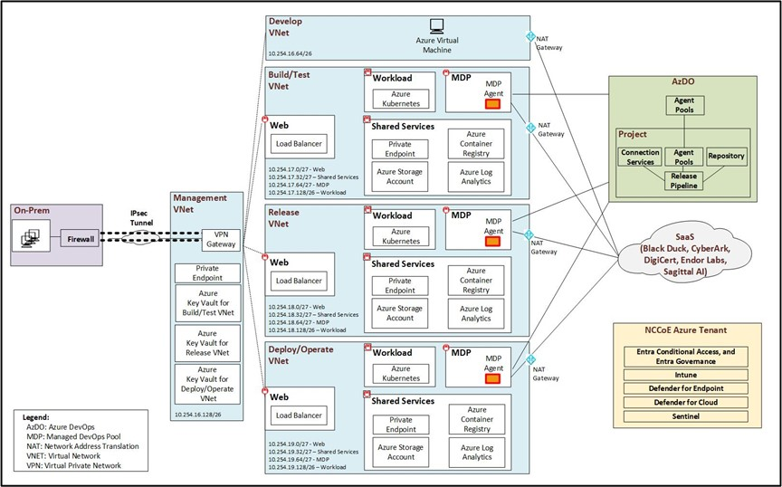

Example Implementations
=======================

This section covers the details for each of the example implementations that are implemented at the NCCoE. Note: Products marked as "N/A" were not included in
specific example implementations. This is due to either the product being unavailable from the collaborator or project time constraints at the NCCoE that
prevented full integration.

.. _e1:

Example Implementation 1 (E1)
-----------------------------

This section describes the architecture and the products used in the example implementation 1 (E1). For the purposes of this document, Example Implementation 1 is referred to as E1. Subsequent implementations will be introduced and numbered sequentially in future publications. The collaborators involved in the E1 include Microsoft,
Black Duck, CyberArk, DigiCert, Endor Labs, and Sagittal AI.

The figure below shows the architecture used in E1. Microsoft Azure Platform as a Service (PaaS) and Azure DevOps (AzDO) are used as the foundation for this
implementation. The E1 environment establishes three separate environments, which provide networking and computing as Infrastructure as a Service (IaaS). These
three environments provide hermetic build environments for providing isolated and independent verification of IaaS and components needed for E1 functionality.
Microsoft Bicep is used to deploy and manage these three environments:

1. The Build/Test environment

2. The Release environment

3. The Deploy/Operate environment

Each environment provides the previously mentioned networking, computing, and services necessary to facilitate E1 experimentation. The list below provides a
descriptive breakdown of components and their purposes:

-  Azure Virtual Network (VNet) – This provides underlying network connectivity and Internet Protocol (IP) address space. It also provides attachment points for
   many supporting services, such as Network Address Translation (NAT) Gateway, Private Endpoints, Load Balancer, and many others. The VNets for E1 include
   Develop, Build/Test, Release, Deploy/Operate and Management VNets.

-  Subnets – Each virtual network is divided into multiple subnets that serve to isolate traffic and group services. These subnets include:

   -  Workload subnet – Workloads in each environment are managed via Azure Kubernetes Services (AKS). These workloads consist of applications that are used to
      simulate functional applications.

   -  Shared Services subnet – The shared services hosted in each environment describe PaaS components that are leveraged commonly across one or more subnet.
      Shared services include Azure Container Registry, Azure Log Analytics, Private Endpoint, and Azure Storage Account

   -  Managed DevOps Pools (MDP) subnet – This service provides on-demand compute to perform automated actions used by Azure DevOps. These actions create,
      destroy, configure, and manage the many resources that are described in this section. MDP services include MDP Agent.

   -  Web subnet – The web subnet provides ingress functionality to each environment. Workloads hosted in the workload subnet are exposed to external
      connectivity via Azure Load Balancers that are provisioned in the Web subnet.

-  Azure Key Vault – This service exists in the management VNet and provides certificates, keys, and secrets to each of the environments that are hosted as part
   of E1.

-  Azure Virtual Machine or Microsoft DevBox – These services provide the compute resources used for management and simulated development activities for E1.

-  Azure DevOps (AzDO) – AzDO is Software as a Service (SaaS) and provides the SCM, ticketing systems, issue tracking, and CI/CD functionality used for E1.

-  NCCoE Azure Tenant – This tenant is used for NCCoE’s DevSecOps project and other NCCoE projects. For the DevSecOps project components below are used
   showcasing the zero trust capabilities used in E1:

   -  Microsoft Entra Conditional Access and Entra Governance – Microsoft Entra Conditional Access provides automated access controls based on user and device
      risk, while Entra Governance manages identity lifecycle and permissions, both serving as core components of a Zero Trust security strategy by ensuring
      only the right users have the right access under the right conditions. Entra Conditional Access is used as the policy Engine (PE)/Policy Administrator
      (PA) and Policy Enforcement Point (PEP).

   -  Microsoft Intune – manages and secures devices and applications, ensuring that only verified and trusted endpoints can access organizational resources,
      which is essential for enforcing Zero Trust principles.

   -  Microsoft Defender for EndPoint – provides advanced threat protection and monitoring for devices, helping to detect, prevent, and respond to security
      threats, which supports Zero Trust by continuously validating device health and security before granting access to resources.

   -  Microsoft Defender for Cloud – provides unified security management and threat protection across cloud and hybrid environments, supporting Zero Trust by
      continuously assessing, monitoring, and enforcing security policies to ensure only secure resources and users can access cloud workloads.

   -  Microsoft Sentinel – security information and event management (SIEM) solution that collects, analyzes, and correlates security data from across an
      organization’s infrastructure to detect, investigate, and respond to threats. In addition to its SIEM capabilities, Sentinel also functions as a Security
      Orchestration, Automation, and Response (SOAR) platform, allowing security teams to automate incident response, orchestrate workflows, and streamline
      security operations through built-in playbooks and integrations with other security tools.

   -  For details of the zero trust implementation at the NCCoE, please refer to the NCCoE’s `Implementing a Zero Trust
      Architecture <https://www.nccoe.nist.gov/projects/implementing-zero-trust-architecture>`__ (ZTA) project. The DevSecOps project reused the components
      implemented for the NCCoE ZTA project.

-  All the other collaborators products including Blackduck, CyberArk, DigiCert, Endor labs, and Sagittal AI are SaaS based and are connected to Microsoft’s
   environment using Microsoft’s NAT Gateway as shown in the figure below.

   
   Implementation 1 Architecture

.. _plan-1:

Plan
~~~~

Table below shows the components used for the Plan phase in E1.

.. table::

   .. list-table:: Plan Phase Products used in E1
      :widths: 32 128
      :header-rows: 1

      - 

         - **Component**
         - **Product**
      - 

         - Certificate Management System
         - | DigiCert Software Trust Manager,
           | Microsoft AKV - Certificate object type
            
      - 

         - Configuration Management System
         - | Microsoft ARM,
           | Microsoft AzDO – Pipelines,
           | Microsoft Azure Dev Center,
           | Microsoft Azure MDP
      - 

         - Credential Management System
         - Microsoft Azure Entra ID
      - 

         - Cyber Intelligence, Threat, and Security Metadata Feeds (e.g., OpenSSF, NVD, OSV, and CVE/CWE)
         - | Endor Labs Reachability-Based SCA - Vulnerability Database,
           | Microsoft MDC,
           | Sagittal Neo
      - 

         - Firmware Services
         - N/A
      - 

         - HSM (including Software or Virtual HSMs)
         - N/A
      - 

         - Product Management System
         - | Microsoft AzDO – Delivery Plans,
           | Sagittal Neo
      - 

         - Project Management System (e.g., Team Planning, Team Collaboration, and Training)
         - | Microsoft AzDO – Sprints and Backlogs,
           | Sagittal Neo
      - 

         - Requirements Management System
         - | Microsoft AzDO – Delivery Plans,
           | Sagittal Neo
      - 

         - Risk Management System
         - | Black Duck SRM,
           | Endor Labs endorctl – Reachability-Based SCA, Endor Code (SAST + Secret Scanning), Container Scanning, Endor Patches, AI Code Security Review,
           | Microsoft Azure Sentinel,
           | Microsoft MDC – Cloud Ops Security, CSPM, CWPP
      - 

         - Secrets Management System
         - | CyberArk Privilege Cloud,
           | CyberArk Secrets Hub,
           | DigiCert Software Trust Manager,
           | Microsoft AKV – Secrets object type
      - 

         - Threat Modeling System
         - | Microsoft Threat Modeling Tool
      - 

         - Ticketing System
         - | Microsoft AzDO – Boards,
           | Sagittal Neo
      - 

         - Zero Trust Security System
         - | Microsoft Azure Entra ID – Conditional Access, Identity Governance,
           | Microsoft Azure PIM,
           | Microsoft Intune,
           | Microsoft MDC,
           | Microsoft Sentinel

.. _develop-1:

Develop
~~~~~~~

Table below shows the components used for the Develop phase in E1.

.. table::

   .. list-table:: Develop Phase Products used in E1
      :widths: 32 128
      :header-rows: 1

      - 

         - **Component**
         - **Product**
      - 

         - Artifact Repository (e.g., Internal and External)
         - | Microsoft ACR,
           | Microsoft AzDO – Artifacts
      - 

         - Artifact Signing and Verification (e.g., Source Code, Commits, Images, Binaries, and Libraries)
         - | Black Duck SCA,
           | DigiCert Software Trust Manager,
           | Endor Labs endorctl – Artifact Signing and Verification,
           | Microsoft ACR
      - 

         - CI/CD Pipeline (Developer Initiated)
         - | Microsoft ARM,
           | Microsoft Azure CLI,
           | Microsoft Bicep
      - 

         - Developer Tools (e.g., IDE, CLI, and Binaries)
         - | Black Duck Polaris Platform – fAST Static, fAST SCA,
           | Black Duck SCA,
           | Black Duck SRM,
           | Black Duck Code Sight (IDE Plugin),
           | Endor Labs endorctl - Reachability-Based SCA, Endor Code (SAST + Secret Scanning), Container Scanner, Endor Patches, AI Code Security Review,
           | Microsoft GitHub Copilot,
           | Microsoft VS Code
      - 

         - IaC Scanner
         - | Black Duck SCA,
           | Endor Labs Endor Code (SAST + Secret Scanning)
      - 

         - IaC Scripts
         - | Microsoft ARM,
           | Microsoft Bicep
      - 

         - Lint Tool
         - | Microsoft GitHub Copilot,
           | Sagittal Neo
      - 

         - Secret Scanner
         - | Black Duck Polaris Platform – fAST SAST,
           | Endor Labs Endor Code (SAST + Secret Scanning)
      - 

         - SCA System
         - | Black Duck Polaris Platform – fAST SCA,
           | Black Duck SCA,
           | Endor Labs Reachability-Based SCA,
           | Sagittal Neo
      - 

         - Software Libraries (e.g., Internal and External)
         - | Microsoft ACR,
           | Microsoft AzDO – Artifacts
      - 

         - SCM System (e.g., Version Control, Commit Hooks, and Branch/Merge protection)
         - | Microsoft AzDO – Repos,
           | Sagittal Neo
      - 

         - SAST System
         - | Black Duck Polaris Platform – fAST Static,
           | Endor Labs Endor Code (SAST + Secret Scanning),
           | Microsoft GitHub Copilot,
           | Sagittal Neo
      - 

         - Unit Test Framework
         - | Microsoft GitHub Copilot,
           | Sagittal Neo
      - 

         - Zero Trust Security System
         - | Microsoft Azure Entra ID – Conditional Access, Identity Governance,
           | Microsoft Azure PIM,
           | Microsoft Intune,
           | Microsoft MDC,
           | Microsoft Sentinel

.. _build-1:

Build
~~~~~

Table below shows the components used for the Build phase in E1.

.. table::

   .. list-table:: Build Phase Products used in E1
      :widths: 32 128
      :header-rows: 1

      - 

         - **Component**
         - **Product**
      - 

         - Artifact Repository (e.g., Internal and External)
         - | Microsoft ACR, 
           | Microsoft AzDO – Artifacts
      - 

         - Artifact Signing and Verification (e.g., Images, Binaries, and Libraries)
         - | Black Duck SCA,
           | DigiCert Software Trust Manager,
           | Endor Labs endorctl – Artifact Signing and Verification,
           | Microsoft ACR,
           | Microsoft AzDO – Pipelines,
           | Open-source Notary Project
      - 

         - Attestation Signing and Verification Tool (e.g., SLSA)
         - N/A
      - 

         - Build Tools (e.g., CLI and Binaries)
         - | Endor Labs Reachability-Based SCA,
           | Microsoft Azure MDP
      - 

         - CI/CD Pipeline (Build Environment, e.g., Automation, Actions, Runners, and Build Agents)
         - | Microsoft AzDO – Pipelines,
           | Microsoft Azure MDP
      - 

         - Container Image Scanner
         - | Black Duck SCA,
           | Endor Labs Container Scanning,
           | Microsoft MDC – Containers
      - 

         - IaC Scanner
         - | Black Duck SCA,
           | Endor Labs Endor Code (SAST + Secret Scanning),
           | Microsoft GHAzDO,
           | Microsoft MDC – DevOps Security
      - 

         - IaC Scripts
         - | Microsoft ARM,
           | Microsoft Bicep
      - 

         - Lint Tool
         - | Microsoft AzDO – Pipeline
      - 

         - SAST System
         - | Black Duck Polaris Platform – fAST SAST,
           | Endor Labs Endor Code (SAST + Secret Scanning),
           | Microsoft GHAzDO,
           | Microsoft MDC – DevOps Security
      - 

         - SCA System
         - | Black Duck Polaris Platform – fAST SCA,
           | Black Duck SCA,
           | Endor Labs Reachability-Based SCA,
           | Microsoft GHAzDO,
           | Microsoft MDC – CWPP, Containers, DevOps Security
      - 

         - Secret Scanner
         - | Black Duck Polaris Platform – fAST SAST,
           | Endor Labs Endor Code (SAST + Secret Scanning),
           | Microsoft GHAzDO
      - 

         - Provenance Generation and Verification Tool (e.g., SBOM)
         - | Endor Labs Reachability-Based SCA,
           | Endor Labs Reachability-Based SCA - SBOM Generation,
           | DigiCert Software Trust Manager,
           | Microsoft SBOM Tool,
           | Open-source Notary Project
      - 

         - Software Libraries (e.g., Internal and External)
         - | Microsoft ACR,
           | Microsoft AzDO – Artifacts
      - 

         - Unit Test Framework
         - | Microsoft AzDO – Pipelines
      - 

         - Zero Trust Security System         
         - | Microsoft Azure Entra ID – Conditional Access, Identity Governance,
           | Microsoft Azure PIM,
           | Microsoft Intune,
           | Microsoft MDC,
           | Microsoft Sentinel

.. _test-1:

Test
~~~~

Table below shows the components used for the Test phase in E1.

.. table::

   .. list-table:: Test Phase Products used in E1
      :widths: 32 128
      :header-rows: 1

      - 

         - **Component**
         - **Product**
      - 

         - Acceptance Test Tool
         - N/A
      - 

         - API Test Tool
         - N/A
      - 

         - Artifact Repository (e.g., Internal and External)
         - | Microsoft ACR,
           | Microsoft AzDO – Artifacts
      - 

         - Artifact Signing and Verification Tool (e.g., Images, Binaries, and Libraries)
         - | Black Duck SCA,
           | DigiCert Software Trust Manager,
           | Endor Labs endorctl – Artifact Signing and Verification,
           | Microsoft ACR,
           | Microsoft AzDO – Pipelines,
           | Open-source Notary Project
      - 

         - Attestation Signing and Verification Tool (e.g., SLSA)
         - N/A
      - 

         - CI/CD Execution, Test and Security Policy Verification Tool
         - N/A
      - 

         - CI/CD pipeline (Test Environment, e.g., Automation, Actions, Runners, and Build Agents)
         - | Microsoft AzDO – Pipelines,
           | Microsoft Azure MDP
      - 

         - Container Image Scanner
         - | Black Duck SCA,
           | Endor Labs Container Scanning,
           | Microsoft MDC - Containers
      - 

         - DAST System
         - | Black Duck Polaris Platform – fAST Dynamic
      - 

         - Fuzz Test Tool
         - N/A
      - 

         - IaC Scanner
         - | Black Duck SCA,
           | Endor Labs Endor Code (SAST + Secret Scanning),
           | Microsoft GHAzDO,
           | Microsoft MDC – DevOps Security
      - 

         - IaC Scripts
         - | Microsoft ARM,
           | Microsoft Bicep
      - 

         - Integration Test Tool
         - N/A
      - 

         - IAST System
         - N/A
      - 

         - Provenance Generation and Verification Tool (e.g., SBOM)
         - | Black Duck Polaris Platform – fAST SCA – SBOM generation,
           | Black Duck SCA – SBOM generation,
           | Endor Labs Reachability-Based SCA,
           | Endor Labs Reachability-Based SCA - SBOM Generation,
           | DigiCert Software Trust Manager,
           | Microsoft SBOM Tool,
           | Open-source Notary Project
      - 

         - Regression Test Tool
         - N/A
      - 

         - SAST System
         - | Black Duck Polaris Platform – fAST Static,
           | Endor Labs Endor Code (SAST + Secret Scanning),
           | Microsoft GHAzDO,
           | Microsoft MDC – DevOps Security
      - 

         - SCA System
         - | Black Duck Polaris Platform – fAST SCA,
           | Black Duck SCA,
           | Endor Labs Reachability-Based SCA,
           | Microsoft GHAzDO,
           | Microsoft MDC – CWPP, Containers, DevOps Security
      - 

         - Smoke Test Tool
         - N/A
      - 

         - Unit Test Framework
         - Microsoft AzDO – Pipelines
      - 

         - Zero Trust Security System
         - | Microsoft Azure Entra ID – Conditional Access, Identity Governance,
           | Microsoft Azure PIM,
           | Microsoft Intune,
           | Microsoft MDC,
           | Microsoft Sentinel

.. _release-1:

Release
~~~~~~~

Table below shows the components used for the Release phase in E1.

.. table::

   .. list-table:: Release Phase Products used in E1
      :widths: 32 128
      :header-rows: 1

      - 

         - **Component**
         - **Product**
      - 

         - Acceptance Test Tool
         - N/A
      - 

         - Artifact Repository (e.g., Internal and External)
         - | Microsoft ACR,
           | Microsoft AzDO – Artifacts
      - 

         - Artifact Signing and Verification Tool (e.g., Images, Binaries, and Libraries)
         - | Endor Labs endorctl – Artifact Signing and Verification,
           | DigiCert Software Trust Manager,
           | Microsoft ACR,
           | Microsoft AzDO – Pipelines,
           | Open-source Notary Project
      - 

         - Attestation Signing and Verification Tool (e.g., SLSA)
         - N/A
      - 

         - CI/CD Pipeline (Release Environment, e.g., Automation, Actions, Runners, and Build Agents)
         - | Microsoft AzDO – Pipelines,
           | Microsoft Azure MDP
      - 

         - Container Image Scanner
         - | Black Duck SCA,
           | Endor Labs Container Scanning,
           | Microsoft MDC - Containers
      - 

         - DAST System
         - Black Duck Polaris Platform – fAST Dynamic
      - 

         - IaC Scanner
         - | Black Duck SCA,
           | Endor Labs Endor Code (SAST + Secret Scanning),
           | Microsoft GHAzDO,
           | Microsoft MDC – DevOps Security
      - 

         - IaC Scripts
         - | Microsoft ARM,
           | Microsoft Bicep
      - 

         - IAST System
         - N/A
      - 

         - Package Management System
         - Microsoft AzDO – Artifacts
      - 

         - Provenance Generation and Verification Tool (e.g., SBOM)
         - | DigiCert Software Trust Manager,
           | Microsoft SBOM Tool,
           | Open-source Notary Project
      - 

         - Release Management System
         - | Microsoft AzDO – Pipelines,
           | Microsoft Azure MDP
      - 

         - SCA System
         - | Black Duck Polaris – fAST SCA,
           | Black Duck SCA,
           | Endor Labs Reachability-Based SCA,
           | Microsoft GHAzDO,
           | Microsoft MDC – CWPP, Containers, DevOps Security
      - 

         - Smoke Test Tool
         - N/A
      - 

         - Zero Trust Security System
         - | Microsoft Azure Entra ID – Conditional Access, Identity Governance,
           | Microsoft Azure PIM,
           | Microsoft Intune,
           | Microsoft MDC,
           | Microsoft Sentinel

.. _deploy-1:

Deploy
~~~~~~

Table below shows the components used for the Deploy phase in E1.

.. table::

   .. list-table:: Deploy Phase Products used in E1
      :widths: 32 128
      :header-rows: 1

      - 

         - **Component**
         - **Product**
      - 

         - Artifact Repository (e.g., Internal and External)
         - | Microsoft ACR,
           | Microsoft AzDO – Artifacts
      - 

         - Artifact Signing and Verification Tool (Verification Only) (e.g., Images, Binaries, and Libraries)
         - | DigiCert Software Trust Manager,
           | Microsoft ACR,
           | Microsoft AzDO – Pipelines,
           | Open-source Notary Project
      - 

         - Attestation Signing and Verification Tool (Verification Only) (e.g., SLSA)
         - N/A
      - 

         - CI/CD Pipeline (Deploy Environment, e.g., Container and Virtualization Environment)
         - | Microsoft AzDO – Pipelines,
           | Microsoft Azure MDP
      - 

         - Deployment Management System (e.g., Release Orchestration, Rollback, and Canary)
         - | Microsoft AzDO – Pipelines,
           | Microsoft Azure MDP
      - 

         - IaC Scanner
         - | Black Duck SCA,
           | Endor Labs Endor Code (SAST + Secret Scanning),
           | Microsoft GHAzDO,
           | Microsoft MDC – DevOps Security
      - 

         - IaC Scripts
         - | Microsoft ARM,
           | Microsoft Bicep
      - 

         - Provenance Generation and Verification Tool (Verification Only) (e.g., SBOM)
         - | Black Duck SCA,
           | DigiCert Software Trust Manager,
           | Endor Labs Reachability-Based SCA – SBOM Generation,
           | Microsoft SBOM Tool,
           | Open-source Notary Project
      - 

         - Zero Trust Security System
         - | Microsoft Azure Entra ID – Conditional Access, Identity Governance,
           | Microsoft Azure PIM,
           | Microsoft Intune,
           | Microsoft MDC,
           | Microsoft Sentinel

.. _operate-1:

Operate
~~~~~~~

Table below shows the components used for the Operate phase in E1.

.. table::

   .. list-table:: Operate Phase Products used in E1
      :widths: 32 128
      :header-rows: 1

      - 

         - **Component**
         - **Product**
      - 

         - CI/CD pipeline (Operate Environment, e.g., Container and Virtualization Environment)
         - | Microsoft AzDO – Pipelines,
           | Microsoft Azure MDP
      - 

         - IaC Scripts
         - | Microsoft ARM,
           | Microsoft Bicep
      - 

         - Runtime Signature Verification Tool
         - N/A
      - 

         - Zero Trust Security System
         - | Microsoft Azure Entra ID – Conditional Access, Identity Governance,
           | Microsoft Azure PIM,
           | Microsoft Intune,
           | Microsoft MDC,
           | Microsoft Sentinel

.. _continuous-improvements-security-and-monitoring-1:

Continuous Improvements, Security and Monitoring
~~~~~~~~~~~~~~~~~~~~~~~~~~~~~~~~~~~~~~~~~~~~~~~~

Table below shows the components used during the continuous improvements, security, and monitoring in E1.

.. table::

   .. list-table:: Continuous Improvements, Security and Monitoring Phase Products used in E1
      :widths: 32 128
      :header-rows: 1

      - 

         - **Component**
         - **Product**
      - 

         - Certificate Management System
         - | DigiCert Software Trust Manager,
           | Microsoft AKV – Certificate object type
      - 

         - CI/CD pipeline (Plan, Develop, Build, Test, Release, Deploy, Operate Environments)
         - | Microsoft AzDO – Pipelines,
           | Microsoft Azure MDP
      - 

         - Configuration Management System
         - | Microsoft AzDO – Pipelines,
           | Microsoft Azure Dev Center,
           | Microsoft Azure MDP,
           | Microsoft ARM
      - 

         - Credential Management System
         - Microsoft Azure Entra ID
      - 

         - Firmware Services
         - N/A
      - 

         - HSM (including Software or Virtual HSMs)
         - N/A
      - 

         - Operations Monitoring System (e.g., Infrastructure Management, Log Management, and Performance Monitoring)
         - | Microsoft Azure Log Analytics,
           | Microsoft MDC – Cloud Ops Security, CSPM, CWPP, DevOps Security, Containers, Endpoint,
           | Microsoft Sentinel
      - 

         - Risk Management System
         - | Black Duck SRM,
           | Endor Labs endorctl – Reachability-Based SCA, Endor Code (SAST + Secret Scanning), Container Scanning, Endor Patches, AI Code Security Review,
           | Microsoft MDC – Cloud Ops Security, CSPM, CWPP, 
           | Microsoft Azure Sentinel
      - 

         - SCM System (e.g., Version Control, Commit Hooks, and Branch/Merge Protection)
         - | Microsoft AzDO – Repos,
           | Sagittal Neo
      - 

         - Secrets Management System
         - | CyberArk Privilege Cloud,
           | CyberArk Secrets Hub,
           | DigiCert Software Trust Manager,
           | Microsoft AKV – Secrets object type
      - 

         - Security Monitoring System (e.g., Vulnerability Management, Incident Management, SIEM, and SOAR)            
         - | Microsoft Azure Log Analytics,
           | Microsoft MDC – Cloud Ops Security, CSPM, CWPP, DevOps Security, Containers, Endpoint, Microsoft Sentinel
      - 

         - Team Collaboration Tools
         - | Microsoft AzDO – Boards, Delivery Plans, 
           | Sagittal Neo
      - 

         - Threat Modeling System
         - Microsoft Threat Modeling Tool
      - 

         - Ticketing System
         - | Microsoft AzDO – Boards,
           | Sagittal Neo
      - 

         - Zero Trust Security System
         - | Microsoft Azure Entra ID – Conditional Access, Identity Governance,
           | Microsoft Azure PIM,
           | Microsoft Intune,
           | Microsoft MDC,
           | Microsoft Sentinel