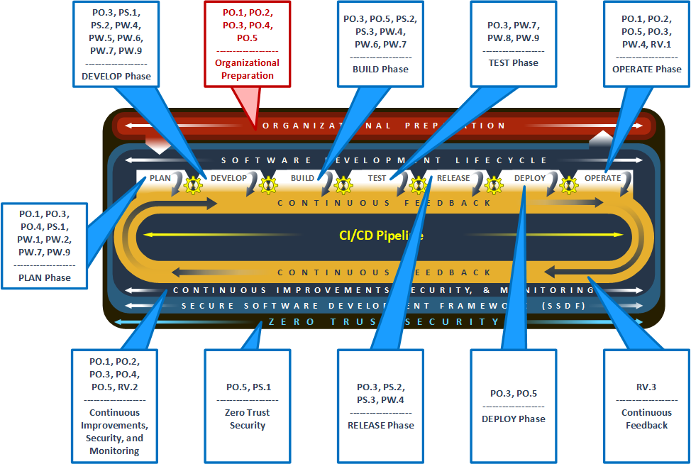

Mapping SSDF to DevSecOps Notional Reference Model :bdg-primary:`New`
======================================================================

The `NIST SSDF <https://csrc.nist.gov/pubs/sp/800/218/final>`__ identifies foundational security principles to help organizations strengthen their secure
software development practices. Specifically, it aims to:

- Protect all software components from tampering and unauthorized access;

- Produce well-secured software;

- Identify residual vulnerabilities in software releases; and

- Respond appropriately to discovered threats.

To demonstrate alignment between the SSDF and the Notional Reference Model for DevSecOps defined earlier in this document, this section provides a high-level
mapping of the SSDF practices to the Notional Reference Model phases. This mapping provides insight into when each practice is performed within the Notional
Reference Model.

   Mapping the SSDF to the Notional Reference Model
   
The mapping is not a complete list of recommended tasks, as the individual tasks to fully achieve a given SSDF practice are unique to each organization. The
SSDF document released by NIST can be used to help define those tasks.

Prepare the Organization (PO)
------------------------------

The practices within the SSDF group, Prepare the Organization (PO), focus on ensuring people, processes, and technology are prepared to perform secure software
development at the organization level.

.. list-table::
   :widths: 59 29 72
   :header-rows: 1

   * - **SSDF Practice**
     - **Notional Reference Model**
     - **Project’s Supporting Activities**
   * - **PO.1:** Define Security Requirements for Software Development
     - Organizational Preparation;
       Operate;
       Continuous Improvements, Security, and Monitoring
     - Identification, documentation, and continuous maintenance of comprehensive organizational-level security requirements that all development
       infrastructures, processes, and software being developed must follow.
   * - **PO.2:** Implement Roles and Responsibilities
     - Organizational Preparation;
       Operate;
       Continuous Improvements, Security, and Monitoring
     - Security-related roles and personnel are identified and filled before development begins, enabling security to be at the forefront of every task
       performed and decision made.
   * - **PO.3:** Implement Supporting Toolchains
     - Organizational Preparation;
       Plan;
       Develop;
       Build:
       Test;
       Release
       Deploy;
       Operate;
       Continuous Improvements, Security, and Monitoring
     - Components used throughout the development lifecycle are identified, installed, and configured such that secure development can be realized.
   * - **PO.4:** Define and Use Criteria for Software Security Checks
     - Organizational Preparation;
       Continuous Improvements, Security, and Monitoring
     - Implementation of checks throughout the development lifecycle to make sure security practices are effective and components are being used properly.
   * - **PO.5:** Implement and Maintain Secure Environments for Software Development
     - Organizational Preparation;
       Build;
       Operate;
       Continuous Improvements, Security, and Monitoring;
       Zero Trust Security
     - To enable secure development, isolated development environments are established and the components to be used are hardened.

Protect the Software (PS)
--------------------------

The practices within the SSDF group Protect the Software (PS) focus on protecting all components of organizational software from tampering and unauthorized
access.

.. list-table::
   :widths: 60 26 74
   :header-rows: 1

   * - **SSDF Practice**
     - **Notional Reference Model**
     - **Project’s Supporting Activities**
   * - **PS.1:** Protect All Forms of Code from Unauthorized Access and Tampering.
     - Plan;
       Develop;
       Zero Trust Security
     - Zero trust concepts are implemented throughout the development lifecycle guiding access to components such as Source Code Management and Cryptographic
       Key Management while also ensuring the principle of least privilege is at the core of all authorization decisions.
   * - **PS.2:** Provide a Mechanism for Verifying Software Release Integrity.
     - Develop;
       Build;
       Release
     - Components such as Artifact Signing and Verification are used to create integrity verification information during the build process with such information
       being made available to acquirers as part of the software release through a Software Bill of Materials (SBOM).
   * - **PS.3:** Archive and Protect Each Software Release.
     - Build;
       Release
     - Components such as the Configuration Management System are used to securely archive all necessary files and supporting data for each software release
       while collecting, safeguarding, and maintaining comprehensive provenance data for all components through a Software Bill of Materials (SBOM).

Produce Well-Secured Software (PW)
-----------------------------------

The practices within the SSDF group, Produce Well-Secured Software (PW), focus on minimizing vulnerabilities through secure design, coding, and testing.

.. list-table::
   :widths: 60 26 74
   :header-rows: 1

   * - **SSDF Practice**
     - **Notional Reference Model**
     - **Project’s Supporting Activities**
   * - **PW.1:** Design Software to Meet Security Requirements and Mitigate Security Risks.
     - Plan
     - Components such as the Requirements Management System and the Threat Modelling System are used to design the software and assess the security risk of the
       design.
   * - **PW.2:** Review the Software Design to Verify Compliance with Security Requirements and Risk Information
     - Plan
     - As part of the tasks to design the software during the plan phase, a review process is established to make sure the design satisfies all security
       requirements.
   * - **PW.3:** (moved to PW.4)
     - n/a
     - n/a
   * - **PW.4:** Reuse Existing, Well-Secured Software When Feasible Instead of Duplicating Functionality
     - Develop;
       Build;
       Operate;
       Release
     - All software libraries and modules leveraged by the development team are properly reviewed before being included and then monitored throughout the
       operational life of the software.
   * - **PW.5:** Create Source Code by Adhering to Secure Coding Practices.
     - Develop
     - The development team follows secure coding practices, and components such as Lint Tool are used to review source code and identify potential issues.
   * - **PW.6:** Configure the Compilation, Interpreter, and Build Processes to Improve Executable Security.
     - Develop;
       Build
     - The CI/CD Pipeline component utilizes compilers, interpreters, and build tools that offer executable security enhancements, and those features are
       required and implemented as part of standardized configurations.
   * - **PW.7:** Review and/or Analyze Human-Readable Code to Identify Vulnerabilities and Verify Compliance with Security Requirements.
     - Plan;
       Develop;
       Build;
       Test
     - Components such as the SAST System are used along with manual code reviews to uncover security-related issues in the code, and all discovered issues are
       recorded and triaged within the Tracking System component.
   * - **PW.8:** Test Executable Code to Identify Vulnerabilities and Verify Compliance with Security Requirements.
     - Test
     - Testing components are used to uncover vulnerabilities missed by previous reviews while ensuring results and remediations are documented in the
       development team’s tracking system.
   * - **PW.9:** Configure Software to Have Secure Settings by Default
     - Plan;

       Develop;

       Test

     - The software is designed to be released with configuration settings that ensure secure operation at the time of installation. These configurations should
       be set by default and be tested to ensure they don’t inadvertently cause security weaknesses or operational issues.

Respond to Vulnerabilities (RV)
--------------------------------

The practices within the SSDF group, Respond to Vulnerabilities (RV), focus on minimizing vulnerabilities through secure design, coding, and testing.

.. list-table::
   :widths: 58 29 73
   :header-rows: 1

   * - **SSDF Practice**
     - **Notional Reference Model**
     - **Project’s Supporting Activities**
   * - **RV.1:** Identify and Confirm Vulnerabilities on an Ongoing Basis
     - Operate
     - Leverage components such as the Security Monitoring Systems to analyze the operating software for missed vulnerabilities as well as monitor public
       vulnerability repositories for newly discovered issues in external libraries, then create tickets for the development team to address discovered issues.
   * - **RV.2:** Assess, Prioritize, and Remediate Vulnerabilities
     - Continuous Improvements, Security, and Monitoring
     - The Ticketing System component is used to continuously assess outstanding issues and schedule new development cycles to address the issues.
   * - **RV.3:** Analyze Vulnerabilities to Identify Their Root Causes
     - Continuous Feedback
     - Analyze identified vulnerabilities to determine their root causes and subsequently reviewing and updating the development process to prevent or reduce
       the likelihood of those root causes recurring in future software development cycles.

