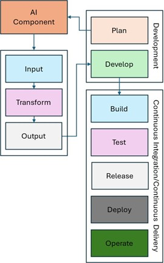
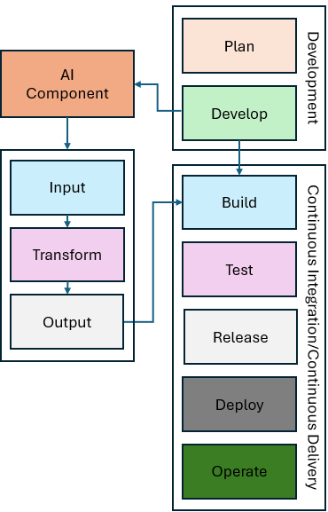
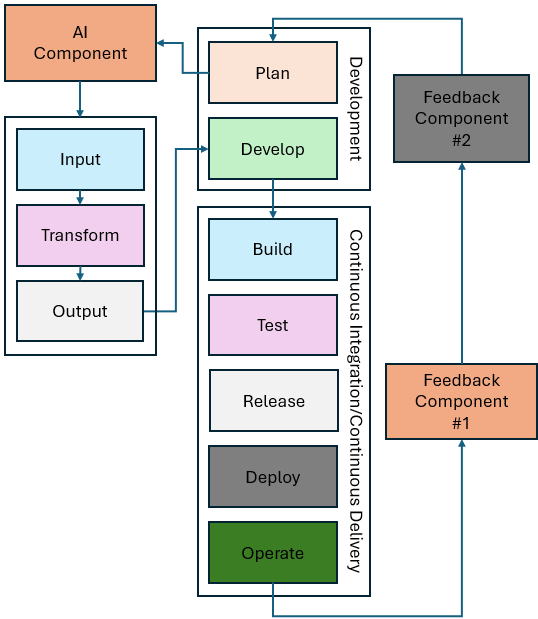

Notional Reference Model for DevSecOps for Demonstration of NIST SSDF :bdg-secondary:`Updated`
=========================================================================================================

As previously noted, this project illustrates how NIST SSDF practices and tasks can be integrated into DevSecOps across the SDLC to help organizations improve their software security. Because SSDF is software-agnostic, the project utilizes an implementation strategy that bridges the gap between high-level recommendations and practical applications. To that end, the project team analyzed the framework's security practices in depth, translating them into actionable objectives for demonstration. Building on this strategic foundation, Section 3 of this document details how SSDF practices map to the project’s notional reference model (outlined in the following paragraphs), while Appendix C provides a comprehensive analysis of those practices and tasks.

To guide this task, the NCCoE developed a notional reference model for SSDF with DevSecOps, which is illustrated in the figure below. The central component of the reference model consists of an SDLC developed and refined in conjunction with the project’s collaborators. DevSecOps is one of many methodologies used to develop software; however, the exact SDLC processes and technology implementations can vary significantly depending on the software’s requirements and the tools and skills available to the development team. Generally, the main SDLC phases proposed with a DevSecOps model may appear similar, although there can be specific alterations to processes even at the most general level. The concrete activities, technologies, and processes used can differ substantially between organizations, and even between groups within an organization. To construct the software factories, the project developed a notional reference model for DevSecOps using a bottom-up approach based on the technologies made available through the project’s collaborators and group consensus concerning essential components. Note that the reference model is vendor-neutral, but the project’s example implementations are vendor-specific. This model is not intended to be a one-size-fits-all solution, but rather a guide for software development efforts.

Each phase of the SDLC represents a logical state and a distinct environment along the path as the software is developed. Furthermore, it highlights an emphasis on feedback through control gates applied before software changes are permitted to proceed to the next stage in the lifecycle. Control gates consist of technical or organizational controls at any phase that are designed to provide the necessary conditions (success or failure), feedback, or insights to inform or direct development, operational, or security tasking to resolve discovered vulnerabilities or defects. By leveraging technologies to apply and automate these controls, this project will demonstrate real-world, repeatable, and verifiable mechanisms to increase the security of software development.

.. figure:: media/vola-image2.png
   :alt: This figure shows DevSecOps notional reference model that NCCoE is using for this project.
   :width: 750px

   Notional Reference Model for DevSecOps for Demonstration of NIST SSDF

The figure above illustrates the project's DevSecOps notional reference model, which includes six functional dimensions that support the demonstration of NIST SSDF:

1. Organizational Preparation: This consists of a secure foundation upon which the SDLC can begin. The foundation includes defined high-level security objectives, an understanding of organizational risks, and a proactive security strategy that fosters a consistent and secure development process.

2. Phases of the SDLC: The lifecycle begins with the Plan phase, where security considerations are incorporated from the start. The
   process then moves through the Develop, Build, Test, Release, Deploy, and Operation phases as shown below:

   a. Plan − Development, operations, and security teams collaboratively define functional, non-functional, and security requirements, establish secure practices, and create roadmaps, updating them as
      feedback from later phases informs new functional or security needs.

   b. Develop − Teams collaboratively create and proactively review code, infrastructure, and policies using approved tools to meet plan phase requirements and ensure
      quality, security, and policy concurrence early in the process. This results in source code, policies, and configurations that are committed to the source code management (SCM) system.

   c. Build − Automated pipelines transform code and configurations into deployable artifacts, using ephemeral environments and integrated analysis to ensure
      quality, security, and policy concurrence while providing actionable feedback to all teams. These processes create provenance and attestation information, which is signed with trusted certificates to ensure the integrity and authenticity of generated artifacts.

   d. Test − Teams use automated testing and ephemeral environments to independently evaluate deployable artifacts for functional, non-functional, and security
      requirements with CI/CD feedback guiding future improvements.

   e. Release − Automated processes package and transfer software to production environments while teams coordinate releases, verify readiness and security,
      document changes, and collect feedback to improve future releases.

   f. Deploy − Automated pipelines install and configure software on production infrastructure while teams monitor deployments, verify security and performance,
      and collect feedback to ensure reliable, secure, and consistent releases.

   g. Operate − Teams use automated monitoring and evidence collection to ensure the integrity, security, and reliability of production systems, using feedback
      to address issues and guide continuous improvement.

3. Continuous Improvements, Security, and Monitoring − This consists of a collection of components and activities that appear throughout the DevSecOps
   lifecycle. These ever-present components provide phase-specific integrations to enable the goals and objectives of a given phase.

4. Continuous Feedback − While not a technology or processing component, this concept covers how events or signals emitted from control gates or learned from
   external events (new technologies, attack patterns, or regulations) are fed back into earlier phases of the DevSecOps lifecycle to inform changes in
   subsequent phases of the lifecycle.

5. Continuous Integration/Continuous Delivery (CI/CD) Pipeline − This technology provides automated pipelines (e.g., continuous build, integration, delivery, and deployment) that run many components unique to each phase of the DevSecOps lifecycle. Different phases of the DevSecOps lifecycle directly influence the components and activities performed by the previously described automated pipelines. While each automated pipeline functions independently from other pipelines, they are combined in sequence to produce the full automated process of building and deploying software to production.

6. Zero Trust Security − This underlying security environment includes all aspects of Zero Trust Architecture (ZTA) implemented at NCCoE, as described in 
   `NIST SP 1800-35 <https://doi.org/10.6028/NIST.SP.1800-35>`__ and `NIST SP 800-207 <https://doi.org/10.6028/NIST.SP.800-207>`__. It includes ZTA components such as Identity, Credential, Access Management (ICAM), Policy Decision Point (PDP), Policy
   Enforcement Point (PEP), Data Security, Security Analytics, Endpoint Security, and Resource Protection.

The details of the notional reference model are provided below.

Organizational Preparation
--------------------------------------------

Before the development lifecycle can begin, the organization performing the development needs to have a strong, secure foundation in place. This foundation enables teams, infrastructure, and processes to be established in support of each individual development effort. Organizations do this by defining high-level security objectives, assessing organizational risks, and crafting a proactive security strategy that fosters a consistent and secure development process.

This process of establishing secure development guidance before development begins enables a “shift-left” approach that incorporates security considerations into software design and development from the outset. By adhering to organizational, government-regulated, and industry-defined policies, standards, and best practices, development teams can ensure the secure and functional operation of software applications. Each team can use these to derive specific requirements for the software application being developed, its dependencies, and the underlying systems.

Phases of the Software Development Lifecycle
--------------------------------------------

The phases of SDLC begin with the Plan phase, where security considerations are incorporated from the start. The process then moves
through Develop, Build, Test, Release, Deploy, and Operate phases unless an error occurs, in which case, the feedback process collects the necessary information
for reevaluation in the Plan phase. Each of these phases is described in detail below. They encompass components provided by the NCCoE's collaborators for
implementation in this project. Not all components used in software development are shown in this architecture, as certain activities (e.g., product management,
disposing of an old system) can take place outside of the SDLC, but within the product’s lifecycle. Components are used across multiple phases, so duplication is seen in component tables. Some components are repeated to confirm that prior phases behaved correctly, while others serve
different purposes in different phases. Those components that are used in all phases are detailed in the `Continuous Improvements, Security and Monitoring of this document <#continuous-improvements-security-and-monitoring>`__.

Plan
~~~~

The Plan phase is the starting point of the SDLC. This phase establishes secure software development and security requirements for the software project (based on organizational guidance), defines the application architecture that incorporates secure design principles, and allocates resources to address threats, vulnerabilities, and defects.

The results of planning activities are used to create development and security roadmaps for updates, repairs, and future enhancements for the project backlog. Initial discussions and con-siderations regarding the toolchain and strategies for automated security checks also begin here.

Because the SDLC is a continuous loop, feedback from later stages constantly informs and refines the initial planning, rather than remaining
static. Initial requirements are established but are then continuously refined based on feedback from subsequent development, security, and operations stages.
This feedback helps clarify technical issues, which in turn lead to new or updated requirements for supported applications, tools, and components.

Each team member contributes distinct expertise during the Plan phase. Developers help define, refine, and address requirements proposed by other team members,
pipeline feedback, or external stakeholders.

Operations team members gather and document functional, non-functional, and security requirements, and may capture them in source code, documentation, or
infrastructure-as-code (IaC) scripts. In this document, source code and IaC scripts are treated similarly, and any component that interacts with source code may provide similar
features for IaC scripts.

Security team members collect security feedback (e.g., discovered vulnerabilities, emerging threats, or evidence of policy deviations) from components in
the Plan phase and throughout the SDLC, often leveraging Continuous Improvements functionality. They are instrumental in conducting threat
modeling, defining security requirements, and ensuring evidence-based verification, collaborating closely with Developers and Operations.

All requirements are tracked as issues or tasks within a shared ticketing system. This system is used by all team members and is visible to people outside of the
team, as understanding the flow of work is important to more than just the DevSecOps team. The figure below illustrates the Plan phase.

.. figure:: media/volb-image2.jpg
   :alt: This diagram shows the components used in the plan phase as shown in the components tablet message.
   :width: 750px

   Plan Phase

Below are Plan phase components that were implemented as part of the project.

- :term:`Certificate Management System`
- :term:`Configuration Management System`
- :term:`Credential Management System`
- :term:`Cyber Intelligence, Threat, and Security Metadata Feeds (e.g., OpenSSF, National Vulnerability Database (NVD), Open Source Vulnerabilities (OSV), and Common Vulnerabilities and Exposures (CVE)/ Common Weakness Enumeration (CWE))`
- :term:`Firmware Services`
- :term:`Hardware Security Module (HSM) (including Software or Virtual HSMs)`
- :term:`Product Management System`
- :term:`Project Management System (e.g., Team Planning, Team Collaboration, and Training)`
- :term:`Requirements Management System`
- :term:`Risk Management System`
- :term:`Secrets Management System`
- :term:`Threat Modeling System`
- :term:`Ticketing System`  
- :term:`Zero Trust Security System`

Develop
~~~~~~~

The Develop phase focuses on software coding, where developers produce source code to create new applications and features, and testers and security teams create
test cases for the new applications and features. This phase also involves collaboration with operations and security team members, who may contribute essential
assets, including source code, IaC scripts, and Policy-as-Code scripts (such as for Zero Trust Architecture). Using approved tools and binaries, developers build new features, embed security and integrity into the code, and verify the integrity of developed artifacts before introducing changes to downstream phases of the SDLC. Ideally, pinned dependencies via immutable identifiers (e.g., cryptographic hashes) and hosting artifacts in internal repositories should be implemented to prevent unauthorized or malicious updates.

Software development team members use various components in the Develop phase to generate source code that implements the requirements defined in earlier
phases. They adopt “shift-left” practices by performing peer reviews and running analyzers—such as Software Composition Analysis (SCA), Static Application
Security Testing (SAST), and linting tools—to identify and remediate flaws or vulnerabilities before committing changes to SCM systems.

Operations team members support development and security efforts, as well as the underlying infrastructure that enables development activities and meets application requirements. Opera-tions personnel use approved client tools and binaries to develop IaC scripts to define the vari-ous environments and supporting artifacts. All developed artifacts are analyzed for technical issues, security vulnerabilities, and policy compliance by other tools and team members using the SCM system's code review tools prior to merging changes into relevant branches, before progressing to later phases in the SDLC.

Security team members coordinate the use of components during the Develop phase to implement security and analysis functions that software development and
operations team members leverage. Additionally, these developed artifacts, metadata, or collected evidence could provide transparency or help apply security and policy
throughout the SDLC. The figure below illustrates the Develop phase.

.. figure:: media/volb-image3.jpg
   :alt: This diagram shows the components used in the develop phase as shown in the components table.
   :width: 750px

   Develop Phase

Below are Develop phase components that were implemented as part of the project.

•	:term:`Artifact Repository (e.g., Internal and External)`
•	:term:`Artifact Signing and Verification Tool` (e.g., Source Code, Commits, Images, Binaries, and Libraries)
•	:term:`CI/CD Pipeline` (Developer Initiated)
•	:term:`Developer Tools (e.g., IDE, CLI, and Binaries)`
•	:term:`IaC Scanner`
•	:term:`IaC Scripts`
•	:term:`Lint Tool`
•	:term:`Secret Scanner`
•	:term:`SCA System` 
•	:term:`Software Libraries (e.g., Internal and External)`
•	:term:`SCM System (e.g., Version Control, Commit Hooks, and Branch/Merge Protection)`
•	:term:`SAST System`
•	:term:`Unit Test Framework` 
•	:term:`Zero Trust Security System`

Build
~~~~~

During the Build phase, source code and configuration files are transformed into deployable artifacts through automated CI/CD components. Decentralized build
pipelines compile code, resolve dependencies, and package components into deployable units. Build environments provide mechanisms to independently verify the
quality and security of these artifacts before integration with downstream systems.

Build, test, and release environments can be ephemeral (e.g., recreated with each iteration) to ensure that source code, software components, and supporting
IaC scripts are secure and function correctly with every pipeline execution.

Software development team members receive feedback from components and activities in the Build phase. This feedback may include flaws detected during the
automated build process, policy failures, or security issues identified by scanning and analysis tools (e.g., container image scanner or secrets scanner).

Operations team members use feedback received from the automated build process components and activities to review IaC and other build-time components for
functional or security issues. They capture feedback in the form of logs, alerts, or other build-time artifacts, which are preserved as evidence and used to
inform changes in the Plan phase to address discovered problems.

Security personnel leverage all feedback generated by automated build components. Build-time analysis detects leaked credentials, secrets, and sensitive
variables; examines the provenance of source code and software dependencies; and verifies cryptographic signatures generated by people and services to ensure
proper authorization and overall integrity. The figure below illustrates the Build phase.

.. figure:: media/volb-image4.jpg
   :alt: This diagram shows the components used in the build phase as shown in the components table.
   :width: 750px

   Build Phase

Below are Build phase components that were implemented as part of the project.

•	:term:`Artifact Repository (e.g., Internal and External)`
•	:term:`Artifact Signing and Verification Tool` (e.g., Images, Binaries, and Libraries)
•	:term:`Attestation Signing and Verification Tool` (e.g., SLSA)
•	:term:`Build Tools (e.g., CLI, and Binaries)`
•	:term:`CI/CD Pipeline` (Build Environment, e.g., Automation, Actions, Runners, and Build Agents)
•	:term:`Container Image Scanner`
•	:term:`IaC Scanner`
•	:term:`IaC Scripts`
•	:term:`Lint Tool`
•	:term:`SAST System`
•	:term:`SCA System`
•	:term:`Secret Scanner` 
•	:term:`Provenance Generation and Verification Tool` (e.g., SBOM)
•	:term:`Software Libraries (e.g., Internal and External)`
•	:term:`Unit Test Framework`
•	:term:`Zero Trust Security System`

Test
~~~~

As part of the Test phase, deployable artifacts are independently evaluated through security and integration testing mechanisms. As in the Build phase, CI/CD
components execute deployable artifacts on decentralized systems to ensure consistency and reliability.

During this phase, software development team members are responsible for implementing and maintaining automated test suites that validate both functional and
non-functional requirements. These tests may include unit test frameworks, integration tests, regression tests, smoke tests, and user acceptance tests. Developers analyze
test results to identify defects or areas for improvement before artifacts progress to later stages.

Operations team members support the Test phase by provisioning and managing ephemeral environments needed for testing. These test environments are built from scratch, code is load-ed, and tests are executed. They may be built using automation, base images, harnesses, and frameworks to ensure consistency and accuracy. Upon completion of each iteration, the logs are retained, results are documented, and test environments are decommissioned to prepare for subsequent executions.

Operations team members ensure that test environments reflect production conditions as much as possible while enabling meaningful and reliable test results. Operations personnel also need to monitor security functions (e.g., policy verification and software vulnerabilities) and system health during testing to identify potential operational issues in the testing infrastructure.

Security team members integrate security-focused tests, such as dynamic application security testing (DAST), fuzz testing, and vulnerability scanning. These
activities help uncover security weaknesses, misconfigurations, or policy violations that could impact the integrity or safety of the software.

Throughout this phase, CI/CD components provide various forms of feedback related to the quality and security of the artifacts. This feedback is used to inform
future development, operational improvements, and security enhancements. The figure below shows the Test phase.

.. figure:: media/volb-image5.jpg
   :alt: This diagram shows the components used in the test phase as shown in the components table.
   :width: 750px

   Test Phase

Below are the Test phase components that were implemented as part of the project.

•	:term:`Acceptance Test Tool`
•	:term:`API Test Tool`
•	:term:`Artifact Repository (e.g., Internal and External)` 
•	:term:`Artifact Signing and Verification Tool` (e.g., Images, Binaries, and Libraries)
•	:term:`Attestation Signing and Verification Tool` (e.g., SLSA)
•	:term:`CI/CD Execution, Test and Security Policy Verification Tool`  
•	:term:`CI/CD Pipeline` (Test Environment, e.g., Automation, Actions, Runners, and Build Agents)
•	:term:`Container Image Scanner`
•	:term:`DAST System` 
•	:term:`Fuzz Test Tool` 
•	:term:`IaC Scanner`
•	:term:`IaC Scripts`
•	:term:`Integration Test Tool` 
•	:term:`IAST System`
•	:term:`Provenance Generation and Verification Tool` (e.g., SBOM) 
•	:term:`Regression Test Tool` 
•	:term:`SAST System`
•	:term:`SCA System`
•	:term:`Smoke Test Tool`
•	:term:`Unit Test Framework`
•	:term:`Zero Trust Security System` 

Release
~~~~~~~

During the Release phase, software applications and their dependencies are packaged and transferred into pre-production or production environments. Automated
release processes ensure that new features, bug fixes, and resolved vulnerabilities are documented and communicated to system and application stakeholders.
Release management components coordinate the release, notify stakeholders, and automate the transfer of released software artifacts into approved artifact
repositories.

Ephemeral release environments ensure that source code, software components, and supporting IaC scripts are secure and function correctly with
every pipeline execution.

Software development team members are responsible for preparing release notes, gathering evidence that all changes have passed the needed tests, and ensuring that
release artifacts meet organizational standards.

Operations team members manage the logistics of the release process, including scheduling deployments, validating the readiness of production environments, and
ensuring that rollback procedures are in place if issues arise. They also monitor the release process to ensure minimal disruption to users and services.

Security team members verify the security configuration of runtime environments, collect release evidence logs, and implement security measures such as least
privilege access controls to protect against potential vulnerabilities during the release and delivery process. They may also perform final security checks or
policy validations before the software is made available to end users.

Throughout the Release phase, feedback from automated tools and manual reviews is collected to inform future improvements in the release process. Note that Automated pipeline controls should support, not replace, manual release authorization. The figure below illustrates the Re-lease phase.

.. figure:: media/volb-image6.jpg
   :alt: This diagram shows the components used in the release phase as shown in the components table.
   :width: 750px

   Release Phase

Below are the Release phase components that were implemented as part of the project.

•	:term:`Acceptance Test Tool`
•	:term:`Artifact Repository (e.g., Internal and External)` 
•	:term:`Artifact Signing and Verification Tool` (e.g., Images, Binaries, and Libraries)
•	:term:`Attestation Signing and Verification Tool` (e.g., SLSA) 
•	:term:`CI/CD Pipeline` (Release Environment, e.g., Automation, Actions, Runners, and Build Agents)
•	:term:`Container Image Scanner`
•	:term:`DAST System`
•	:term:`IaC Scanner`
•	:term:`IaC Scripts`
•	:term:`IAST System`
•	:term:`Package Management System`
•	:term:`Provenance Generation and Verification Tool` (e.g., SBOM) 
•	:term:`Release Management System`
•	:term:`SCA System`
•	:term:`Smoke Test Tool`
•	:term:`Zero Trust Security System`

Deploy
~~~~~~

During the Deploy phase, automated components install and configure packaged software and its dependencies on the production system. Correct installation and configuration are verified. This process is typically orchestrated by CI/CD pipelines, which ensure consistency and repeatability. Automated scans and runtime analyzers verify and assess the runtime status of software applications and systems, evaluating security posture, application performance, and operational quality.

Software development team members may review configuration management components (e.g., deployment scripts, configuration files, and documentation) to support
a smooth deployment process. They are also responsible for gathering evidence for any issues that arise during deployment.

Operations team members oversee the deployment processes—such as rolling or blue/green deployment ensuring that infrastructure is properly provisioned and
configured to support the new release. They monitor deployment progress, validate successful installation, and manage any needed rollbacks in the event of a
deployment failure.

Security team members monitor deployments for potential vulnerabilities or misconfigurations, leveraging automated tools to detect anomalies or unauthorized
changes. They may also implement runtime security controls, such as artifact verification, configuration management, and continuous monitoring, to maintain the
integrity and security of the production environment.

Throughout the Deploy phase, feedback from automated tools and monitoring systems is collected to inform future improvements and to ensure that deployments meet
organizational standards for security, reliability, and performance. The figure below illustrates the Deploy phase.

.. figure:: media/volb-image7.jpg
   :alt: This diagram shows the components used in the deploy phase as shown in the components table.
   :width: 750px

   Deploy Phase

Below are the Deploy phase components that were implemented as part of the project.

•	:term:`Artifact Repository (e.g., Internal and External)` 
•	:term:`Artifact Signing and Verification Tool` (Verification Only) (e.g., Images, Binaries, and Libraries)
•	:term:`Attestation Signing and Verification Tool` (Verification Only) (e.g., SLSA) 
•	:term:`CI/CD Pipeline` (Deploy Environment, e.g., Container and Virtualization Environment)
•	:term:`Deployment Management System (e.g., Release Orchestration, Rollback, and Canary)`
•	:term:`IaC Scanner`
•	:term:`IaC Scripts`
•	:term:`Provenance Generation and Verification Tool` (Verification Only) (e.g., SBOM)
•	:term:`Zero Trust Security System`

Operate
~~~~~~~

The Operate phase encompasses the running applications, binaries, software dependencies, and system components that make up the production environment.
Automated processes provide stakeholders with documented evidence of application and system component integrity, SBOM, and attestations.

Software development team members may be involved in monitoring application behavior to address defects and implement changes based on operational feedback.
This feedback from components, services, and the operations and security teams helps resolve incidents, inform root-cause analysis and post-mortem reviews,
and meet the requirements of deployed software applications.

Operations team members are responsible for maintaining the underlying systems (e.g., containerized, virtualized, and cloud infrastructures). They monitor system metrics, manage infrastructure resources, and respond to incidents or outages. Operations teams require visibility into application code when investigating problems (e.g., they need to understand which software artifacts are currently deployed, when they were built, from which source commits, with which dependencies, and any known vulnerabilities).

Security team members continuously monitor the production environment for threats, vulnerabilities, and policy violations. They leverage automated tools for intrusion detection, log analysis, and monitoring. While not used to generate or verify artifacts in this phase, security personnel also review provenance information (e.g., SBOMs) to verify that only authorized software dependencies and components are running in production.

Throughout the Operate phase, feedback from monitoring, logging, and security tools is collected and analyzed. This feedback is used to inform future planning,
development, and operational improvements, ensuring that the software supply chain remains secure and resilient. The figure below shows the Operate phase.

.. figure:: media/volb-image8.jpg
   :alt: This diagram shows the components used in the operate phase as shown in the components table.
   :width: 750px

   Operate Phase

Below are the Operate phase components that were implemented as part of the project.

•	:term:`CI/CD Pipeline` (Operate Environment, e.g., Container and Virtualization Environment)
•	:term:`IaC Scripts`
•	:term:`Runtime Signature Verification Tool`
•	:term:`Zero Trust Security System`

Continuous Improvements, Security, and Monitoring
------------------------------------------------

Continuous Improvements, Security, and Monitoring is not a distinct phase of the SDLC, but rather a set of persistent services and activities
that span all phases. Components present in Continuous Improvements, Security, and Monitoring provide ongoing monitoring, assessment, and management of systems,
applications, and supporting infrastructure throughout the entire lifecycle. Continuous Improvements, Security, and Monitoring components are responsible for
detecting and notifying stakeholders of system and application deviations, anomalies, and performance issues across various timescales. These automated
processes deliver continuous visibility into the health, security, and integrity of all system components, which enable detection and response to threats that
could impact security, integrity, or availability.

While the specific activities performed by Continuous Improvements, Security, and Monitoring components are tailored to the needs of each SDLC phase, their overarching goal is to ensure that all systems meet the requirements necessary for deployed software applications.

Software development, operations, and security team members all rely on feedback generated by Continuous Improvement, security, and monitoring to inform their
activities, drive improvements, and maintain a secure software supply chain. These team members leverage components from Continuous Improvements, Security, and
Monitoring to perform tasks such as addressing system failures, responding to security or operational incidents, or handling escalating issues associated with
running software applications and supporting systems. The figure below illustrates the role of Continuous Improvements, Security, and Monitoring within the
notional architecture.

.. figure:: media/volb-image9.jpg
   :alt: This diagram shows the components used in the continuous improvements, security and monitoring as shown in the components table.
   :width: 750px

   Continuous Improvements, Security, and Monitoring

Below are the Continuous Improvements, Security, and Monitoring components that were implemented as part of the project. These components are used in every phase of the SDLC.

•	:term:`Certificate Management System`
•	:term:`CI/CD Pipeline` (Plan, Develop, Build, Test, Release, Deploy, and Operate Environments) 
•	:term:`Configuration Management System`
•	:term:`Credential Management System`
•	:term:`Firmware Services`
•	:term:`Hardware Security Module (HSM) (including Software or Virtual HSMs)`
•	:term:`Operations Monitoring System (e.g., Infrastructure Management, Log Management, and Performance Monitoring)`
•	:term:`Risk Management System`
•	:term:`SCM System (e.g., Version Control, Commit Hooks, and Branch/Merge Protection)`
•	:term:`Secrets Management System`
•	:term:`Security Monitoring System (e.g., Vulnerability Management, Incident Management, Security Information and Event Management (SIEM), and Security Orchestration, Automation, and Response (SOAR))`
•	:term:`Team Collaboration Tools`
•	:term:`Threat Modeling System`
•	:term:`Ticketing System`
•	:term:`Zero Trust Security System`

Continuous Feedback 
--------------------

The Continuous Feedback cycle is an adaptive, iterative process that aggregates decision criteria (such as success, failure, or anomaly signals) from across the SDLC and uses them to drive ongoing improvements in development efficiency, operational quality, and security posture. This comprehensive feedback is systematically delivered to teams at the earliest point of detection. This process facilitates the “shift-left” mechanism, which ensures that issues, particularly security vulnerabilities and policy deviations, are identified and addressed proactively, enabling the rapid delivery of secure, high-quality, and resilient software.

Continuous Integration/Continuous Delivery (CI/CD) Pipeline
-----------------------------------------------------------

CI/CD pipelines form automated systems that orchestrate the continuous building, testing, release, and deployment of software or system artifacts and generate
necessary evidence throughout the various pipeline stages. The CI/CD pipelines documented in this notional architecture are comprised of these five
interconnected stages:

1. **Continuous Build:** This stage consists of automated build mechanisms that stage source code, software, system dependencies, and configuration items
   for the purposes of building software and system artifacts. Automated processes in this stage are commonly associated with either polling or triggering
   effects coupled with changes to source code or configuration items. Artifacts and evidence (e.g., notifications, alerts, and logs) are generated during
   the continuous build process and then passed downstream to the next phases of automation.

2. **Continuous Integration (CI)**: As build artifacts are staged in a testing environment, this CI component performs an assortment of tests and assessments to
   verify operational integrity prior to deployment. These components integrate security testing and analysis via SAST, SCA, and various asset
   scanners (e.g., secrets, IaC, and container image scanners) to detect defects, security vulnerabilities, and configuration issues.

3. **Continuous Delivery (CD)**: Once tested, automated processes package the generated artifacts (e.g., software assets and configuration items) for release.
   These artifacts are delivered to distribution systems such as artifact repositories, package managers, or SCMs. These packaged artifacts are continually
   tested and assessed for defects, security vulnerabilities, or configuration issues.

4. **Continuous Deployment**: Released artifacts are retrieved from artifact repositories, package managers, or SCMs and deployed into the operational
   environment using automated processes. These processes can consist of various deployment strategies such as blue/green or canary-based deployments. Deployed
   artifacts, software systems, and software applications in the operational environment are constantly assessed for defects, security vulnerabilities, and
   configuration issues.

5. **Continuous Operations**: Deployed artifacts and their environments (e.g., hosts, networks, and services) are monitored for defects, security
   vulnerabilities, and configuration issues. The environment is updated as needed with infrastructure patches and configuration changes. The results feed into
   the continuous improvement cycle, providing necessary information for engineers to make changes to the software and its environment.

Software conceptually flows through each of these automated processes sequentially. However, each  of the CI/CD pipeline stages has presence in one or more lifecycle
phases. Detection of defects or vulnerabilities at each lifecycle phase will trigger failure states and distribute the necessary evidence to notify
stakeholders. Automated processes and teams review evidence generated in each phase. This evidence is used to verify the requirements of source code,
software assets, or configuration changes. It's the combination of generated evidence and artifacts that provides the necessary feedback to continue the
software development throughout the lifecycle.

Zero Trust Security
-------------------

Zero Trust serves as an underlying component of this architecture. Each phase depends on operating in a Zero Trust environment. ZTA operates on the
principle of "never trust, always verify," enforcing strict identity authentication and authorization for every user and device attempting to access resources,
regardless of their location. It also assesses the device posture—evaluating the security health of the accessing device. Based on the continuous
assessment of user/system identity and device posture, only the "least privilege access" is granted for devices that meet security requirements, and these permissions are revoked
when no longer needed. This approach prevents lateral movement of attackers within a network.

Specifically, Zero Trust is being implemented at the NCCoE within SDLC as shown below:

-  Enforcing Strict Access Controls: ZTA requires continuous assessment of user/system identity and device posture, authenticating and authorizing user/system
   access according to the policy. The user/system cannot access resources for which they are not approved. This includes but is not limited to source code repositories, infrastructure, and developer workstations.

-  Granting Least Privilege Access: Based on continuous assessment, only devices that meet security requirements are granted least privilege access for the duration of the session. Users/systems are granted only the least privileges necessary for the specific role they play and the pipeline.

-  Preventing Lateral Movement: Continuously verifying every access attempt and allowing access only to the needed resource prevents lateral movement within a network or pipeline.

-  Securing Pipeline Identities: Within the pipeline, Zero Trust is applied by assigning a unique identity to the application and ensuring this pipeline
   identity adheres to zero-trust principles.

-  Securing Pipeline and Code Repository Actions: All pipeline actions and code repository actions (e.g., merge requests) must be initiated and/or approved by authorized entities.

-  Isolating Actor Identities: The identities of the pipeline itself and the actors (users/systems) who initiate pipeline activities are kept unique and
   independent.

-  Device Posture Verification for Access: Access to pipeline resources is granted only if the initiating device's security posture meets the predefined
   security policies.

-   Securing Container Images and Build Artifacts: Zero Trust policy is applied by enforcing source verification requirements. All container images must be sourced from trusted registries, and all build artifacts must be cryptographically signed and verified. SBOMs for container images and build artifacts are cryptographically signed and verified. SBOMs for deployed applications are continuously reviewed for newly discovered vulnerabilities.

-   Continuous Diagnostics and Mitigation: DevSecOps infrastructure and systems are continuously monitored, and mitigations are automatically triggered in response to incidents or Zero Trust policy violations.

This approach ensures that every interaction within the CI/CD pipeline, whether human or automated, is authenticated, authorized, and
continuously validated against strict security policies, thereby enhancing the overall security posture and integrity of the software supply chain.

As AI capabilities become increasingly integrated into the SDLC, it is critical for Zero Trust principles to be extended to AI-enabled systems, agents, and services. AI components should be identified, inventoried, and assigned managed identities within the enterprise architecture. Access by AI systems to source code repositories, build systems, artifact registries, models, data sources, APIs, and infrastructure should be continuously authenticated, authorized, and governed ac-cording to least-privilege principles. Communications between AI-enabled components should be protected through Zero Trust controls, while access to data, software artifacts, and other sensitive re-sources should be continuously monitored and restricted based on mission need. AI-enabled applica-tions, models, prompts, agents, and supporting infrastructure should be developed using se-cure-by-design principles and protected against emerging threats. AI should be deployed using careful threat modeling, robust governance, and a secure-by-default approach to configuration with clear, specific, and constrained guardrails. Security monitoring, threat detection, and incident response processes should also be extended to include AI-specific risks and behaviors to ensure the integrity, security, and trustworthiness of AI-enabled DevSecOps operations. Risk assessments should be per-formed and used to determine which higher-risk and higher-impact decisions should require a human in the loop. Monitoring and auditing data should be regularly evaluated to validate proper governance and policy enforcement throughout the organization.

The NCCoE DevSecOps project leveraged the NCCoE’s Zero Trust project environment, which included components such as Identity Credential Access Management
(ICAM), Policy Decision Point (PDP), Policy Enforcement Point (PEP), Data Security, Security Analytics, Endpoint Security, and Resource Protection. For more
information about NCCoE’s Zero Trust Architecture project, please refer to the NCCoE’s `Implementing a Zero Trust
Architecture <https://www.nccoe.nist.gov/projects/implementing-zero-trust-architecture>`__ site.

Artificial Intelligence :bdg-primary:`New`
-------------------------------------------

AI provides opportunities to optimize how organizations plan, develop, secure, deploy, and operate software systems. Rather than viewing AI as a standalone capability, our approach is to integrate AI into the SDLC in a controlled, measurable, and risk-aware manner.

AI enables teams to work more efficiently, accelerate delivery timelines, and identify security concerns earlier in the development lifecycle. However, as with any emerging technology, AI adoption must be balanced with robust security, governance, and operational risk management. While modern AI systems can generate code, make recommendations, and act autonomously, these capabilities introduce risks such as inaccurate outputs, insecure code generation, unauthorized actions, limited explainability, hallucinated security recommendations, and data leakage. Furthermore, risks include excessive privileges granted to AI agents, context tampering (e.g., model, prompt, or workflow), and AI-generated artifacts entering the supply chain without provenance or approval.

Consequently, operational, security, and software development teams must ensure that AI-generated content is monitored and validated by human stakeholders, with established security processes in place to maintain accuracy and trust. 

In this project, we adopted a phased approach to implementing AI in DevSecOps. The current phase demonstrates human-directed Generative AI capabilities, while future phases will introduce Agentic AI to enable autonomous multi-step execution and tool interaction in the software development lifecycle.

In the current phase, we leveraged Generative AI to automate requirements generation, task decomposition, ticketing, source code generation and modification, infrastructure configurations, and test case creation, while utilizing code scanning and vulnerability detection for security analysis and remediation summaries. To ensure quality and security, this initial phase operated under direct human supervision, requiring users to review and validate all AI-generated outputs. 

This implementation focuses on the Plan, Develop, and Continuous Feedback phases of the proposed Notional Reference Model for DevSecOps, where the collaborator technologies were available. These phases offer opportunities to improve productivity while maintaining human oversight and minimizing operational risk; at this stage, AI acts as an advisor and assistant rather than an autonomous decision-maker. This phased approach allows the organization to gain experience with AI technologies, establish governance, and build trust before introducing higher levels of automation. To maintain integrity, all AI-generated outputs should be traceable to their source context, reviewed through established SDLC control gates, logged for auditability, and approved by accountable stakeholders before being utilized as requirements, code, configurations, or deployment inputs. 

**Plan Phase:**

During the Plan phase of SDLC, we used AI tools to help the team transform requirements into actionable work items. Activities that occur during this phase involve usage of AI for task documentation, decomposition, and assignment. Descriptive material, also known as context, provides AI applications with work requirements to be organized, broken down, or summarized appropriately. AI may recommend work items, assignments, priorities, and remediation actions; however, acceptance, prioritization, and execution remain the responsibility of authorized human stakeholders. During the Plan phase of SDLC, we used AI to analyze project documentation, requirements, and stakeholders including:

-  Generate work items, issues, tasks, user stories, epics, or milestones
-  Decompose large requirements into manageable tasks
-  Identify missing requirements or software dependencies
-  Provide remediations, mitigations, or implementations based on provided frameworks or control standards
-  Assist with project documentation, knowledge management, and team communication
-  Support threat modeling activities
-	Perform risk-based prioritization

The diagram below describes an example of an AI-assisted Plan phase. The AI component shown in the diagram performs the planning activities as described above. When completed, the planned activities are coordinated with a developer in the Develop phase. Output is reviewed and submitted by the developer to begin the CI/CD pipeline, with content submitted to the Build phase.

   Notional Reference Model with AI-assisted Plan Phase

**Develop Phase:**

Develop phase activities executed by the team can be assisted by chat- or agent-based applications, using tools installed on individual systems or provided by online platforms. These tools can interface with documentation, source code, or other contexts to assist in tasks such as code generation, unit test generation, static application security analysis, or other software and system tool interactions. The results of these activities should be evaluated to verify the functional and security postures of any modifications. During the Develop phase of SDLC, we used AI directly in software development activities, where we used AI-powered assistants through chat interfaces and integrated development environments (IDEs) to accelerate tasks, including: 

-  Generate source code and infrastructure-as-code (IaC) 
-  Generate unit and integration tests
-  Assist with API development and documentation
-  Refactor source code or configurations based on user-provided recommendations or other context
-  Generate project documentation
-  Analyze software or system dependencies for issues
-  Provide more secure code recommendations
-  Analyze security and vulnerability reports
-  Interpret threat modeling information
-  Build security control mappings and documentation
-  Manage source code or configurations
-  Assist with building automation for CI/CD pipelines
-  Inspect and recommend changes based on analyzed system architectures

The diagram below describes an example of an AI-assisted Develop phase. A developer coordinates with AI components to perform the development activities described in the list above. In this example, the AI content is submitted to the Build phase to initiate CI/CD pipeline automation.

   Notional Reference Model with AI-assisted Develop Phase

AI-generated outputs are always reviewed through established DevSecOps processes, including peer review, security validation, automated testing, and approval workflows. In this phase, AI assists with execution but does not independently deploy or modify production environments.

**Continuous Feedback:**

As components and activities occur during the SDLC, context can be gathered from logs and other outputs as part of the Continuous Feedback process. This context can be utilized by various AI technologies to assist with troubleshooting, security remediation, or other corrective actions. Corrective actions could include generating new source code, configuration data, or other changes to software or system state, using the feedback for future Plan and Develop phase activities to finally resolve any discovered issues. AI-generated corrective actions should be treated as proposed inputs to future planning or development activities and should not modify software, configurations, or system state without review and approval through established DevSecOps processes. During the Continuous feedback phase, we used AI systems to analyze information generated throughout the software lifecycle, including:

-  Generated systems or software application logs
-  Generated security events or discovered vulnerabilities
-  Published vulnerability reports or threat metadata
-  Generated system or software performance metrics
-  Captured or documented operational incidents
-  Deployment logs or other historical context on past deployments

Using this information, AI can:

-  Identify emerging trends and potential security or implementation anomalies
-  Recommend remediations, mitigations, or corrective actions for discovered vulnerabilities
-  Prioritize new or existing software or system vulnerabilities
-  Assist with root-cause analysis
-  Recommend improvements for documented processes and activities

The diagram below describes an example of AI-assisted Continuous Feedback. The AI components will automatically respond to content being generated by one or more feedback components and submitted to Plan phase components. Once received, the AI component will proceed through the Plan phase example described earlier in this section.

   Notional Reference Model with AI-assisted Feedback

By leveraging AI tools, the role shifts from manual execution to orchestration. Now, team members can utilize AI chat interfaces to generate implementation plans based on existing tickets and repositories. Integrated AI tools further accelerate the process by generating code changes, authoring tests, and executing security scans. Rather than writing every line of code during the Develop phase, the engineer now focuses on reviewing AI-generated output via the source control management (SCM) system and issue tracker. This transition ensures that deployments remain consistent, scalable, and aligned with the team's SDLC requirements.

Our future phase will introduce Agentic AI capabilities. Unlike today's Generative AI assistants, Agentic AI systems can execute multi-step workflows, interact with tools, retrieve information, make decisions based on objectives, and coordinate activities across multiple systems. Future project work will explore an AI-enabled DevSecOps ecosystem where planning, development, security, operations, and continuous feedback operate as a connected lifecycle. Human experts remain responsible for governance, approval, and mission outcomes, while AI may support and accelerate analysis, automation, and execution. It's important to ensure that any reviews or changes proposed by AI are assessed by stakeholders before implementation.

For additional NIST guidelines regarding cybersecurity opportunities and risks related to AI adoption and use, please refer to the `NIST Cyber AI Profile <https://www.nccoe.nist.gov/projects/cyber-ai-profile>`__. 
