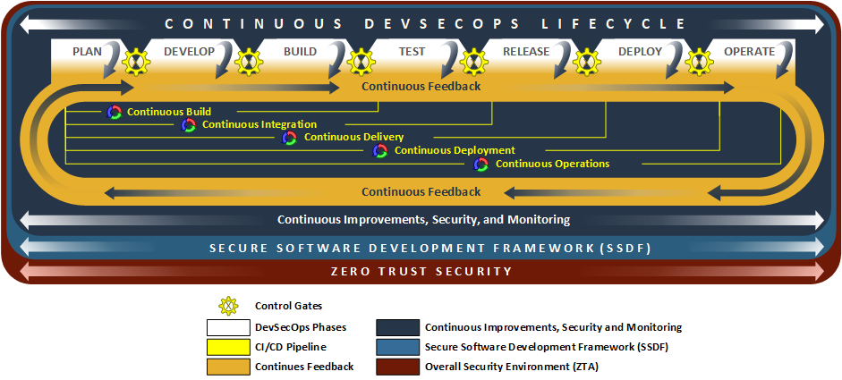
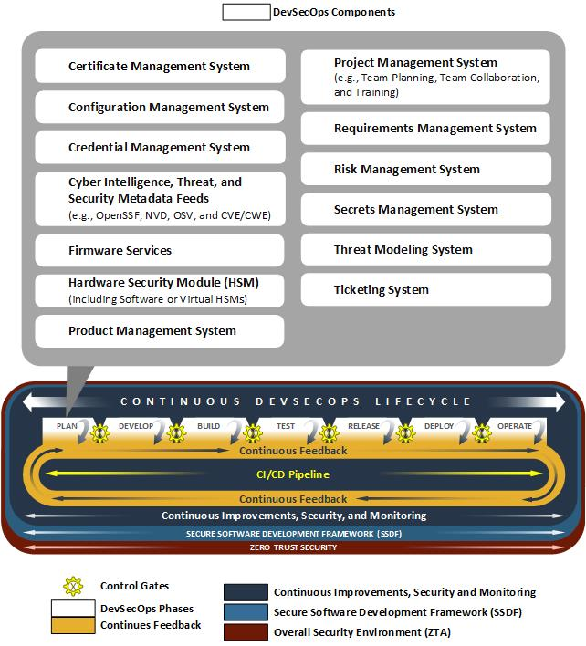
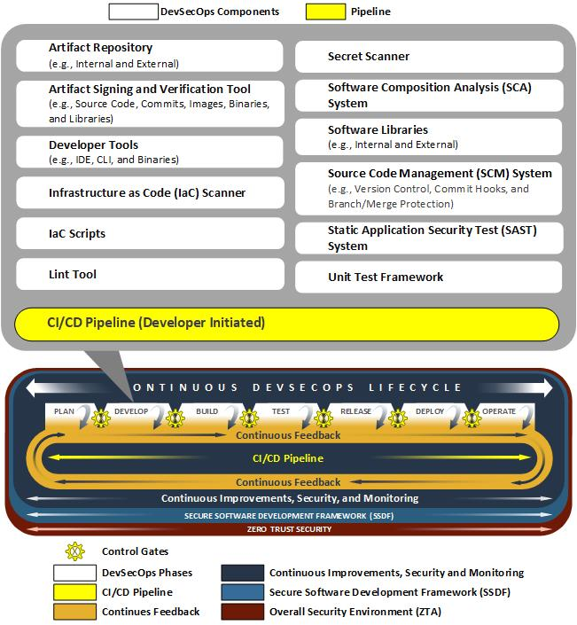
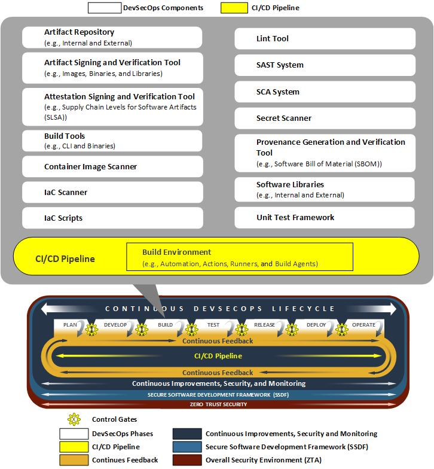
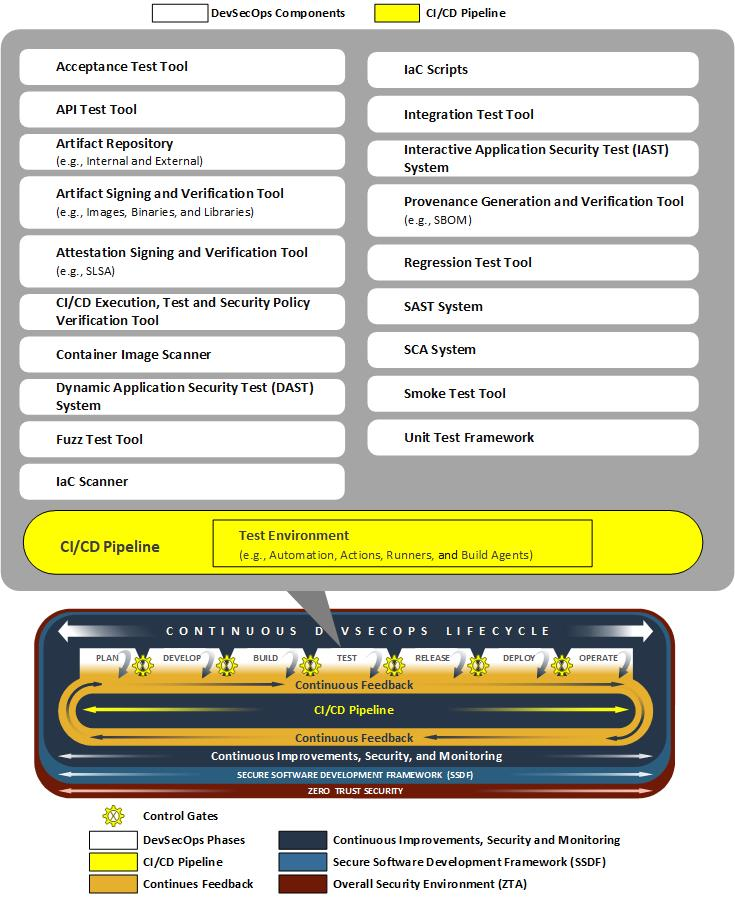
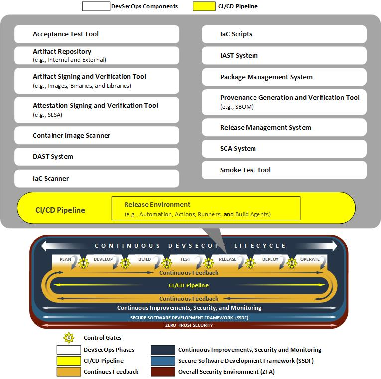
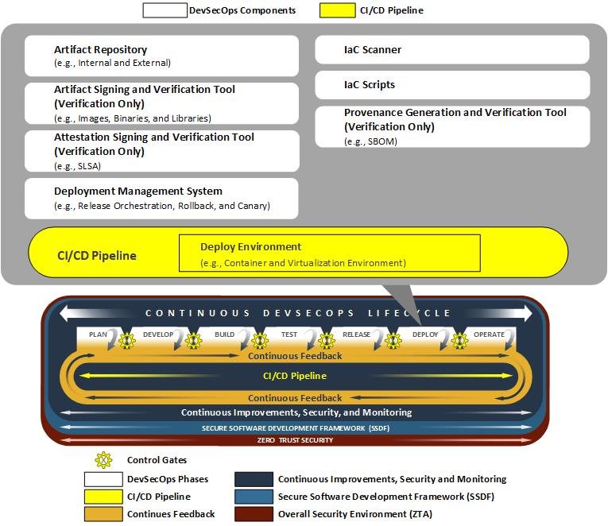
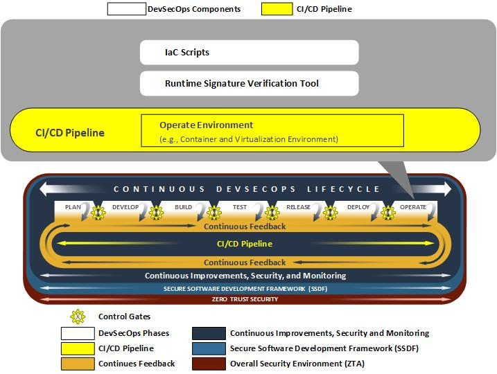
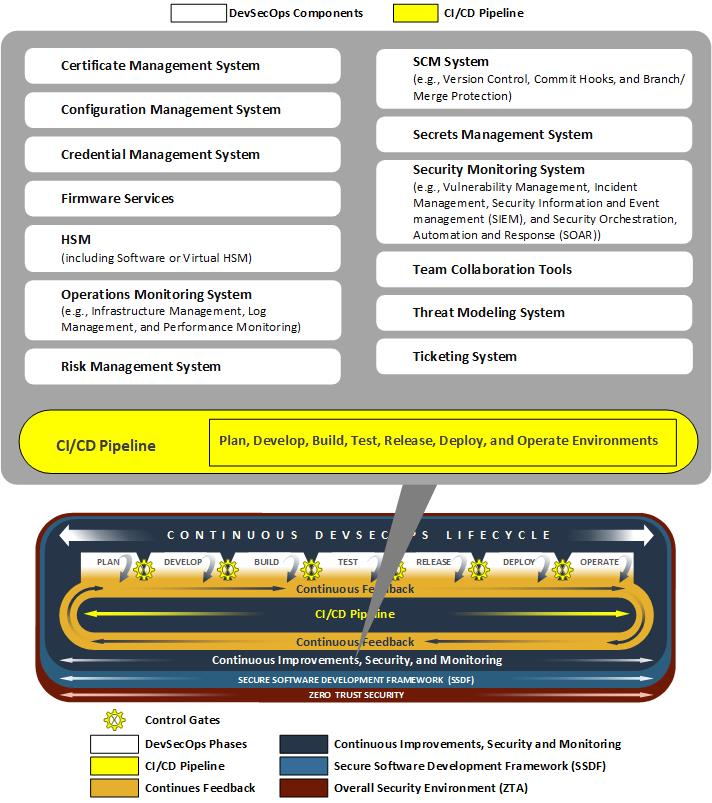

Notional Reference Model for DevSecOps for Demonstration of NIST SSDF 
=========================================================================================================

As mentioned earlier, this project illustrates how NIST SSDF practices and tasks can be implemented in DevSecOps to aid organizations in improving the security of the software they develop and operate. Since the SSDF does not provide a specific software development architecture, the project adopted a strategy to define a development model that bridges the gap between the SSDF’s recommended security practices and practical implementation. To that end, the project interpreted the NIST SSDF recommended security practices with the objective of decomposing them into more granular and actionable tasks. Building on this strategic foundation, future versions of this document will document and justify the concrete connections between technologies and activities that exist in the example implementations and the SSDF proper.

To guide this task, the NCCoE developed a notional reference model for SSDF with DevSecOps, which is illustrated in the figure below. This model was developed and refined in conjunction with the project’s collaborators. DevSecOps is one of many methodologies used to develop software; however, the exact process and technology implementations can vary significantly depending on the software's requirements and the tools and skills available to the development team. Generally, the main phases of a DevSecOps model are similar, although there can be variations even at the most general level. The concrete activities, technologies, and processes used can differ substantially between organizations, and even between groups within an organization. To construct the software factories, the project developed a notional reference model for DevSecOps using a bottom-up approach based on the technologies made available through the project’s collaborators and group consensus concerning essential components. This model is not intended to be a one-size-fits-all solution, but rather a guide for software development efforts.

Each phase of the development process represents a logical stage and a separate environment in the path as the software is developed. Furthermore, it highlights the emphasis on feedback using control gates that are applied before software changes are permitted to proceed to the next stage in the lifecycle. Control gates consist of technical or organizational controls that are designed to provide the necessary feedback or insights that help inform development, operational, or security tasking for resolving discovered vulnerabilities or defects. By leveraging technologies to apply and automate these controls, this project will demonstrate real-world, repeatable, and verifiable mechanisms to increase the security of software development.

   Notional Reference Model for DevSecOps for Demonstration of NIST SSDF

The figure above illustrates the project's DevSecOps notional reference model, which includes five functional dimensions that support the demonstration of NIST SSDF:

1. Phases of Continuous DevSecOps Lifecycle: The lifecycle begins with the Plan phase, where security considerations are incorporated from the start. The
   process then moves through Develop, Build, Test, Release, Deploy, and Operation phases as shown below:

   a. Plan − Development, operations, and security teams collaboratively define functional, non-functional, and security requirements, establish secure practices, and create roadmaps, updating them as
      feedback from later phases informs new functional or security needs.

   b. Develop − Teams collaboratively create and proactively review code, infrastructure, and policies with approved tools to meet plan phase requirements and ensure
      quality, security, and policy concurrence early in the process.

   c. Build − Automated pipelines transform code and configurations into deployable artifacts, using ephemeral environments and integrated analysis to ensure
      quality, security, and policy concurrence while providing actionable feedback to all teams.

   d. Test − Teams use automated testing and ephemeral environments to independently evaluate deployable artifacts for functional, non-functional, and security
      requirements with CI/CD feedback guiding future improvements.

   e. Release − Automated processes package and transfer software to production environments while teams coordinate releases, verify readiness and security,
      document changes, and collect feedback to improve future releases.

   f. Deploy − Automated pipelines install and configure software on production infrastructure while teams monitor deployments, verify security and performance,
      and collect feedback to ensure reliable, secure, and consistent releases.

   g. Operate − Teams use automated monitoring and evidence collection to ensure the integrity, security, and reliability of production systems, using feedback
      to address issues and guide continuous improvement.

2. Continuous Improvements, Security, and Monitoring − This consists of a collection of components and activities that appear throughout the DevSecOps
   lifecycle. These ever-present components provide phase-specific integrations to enable the goals and objectives of a given phase.

3. Continuous Feedback − While not a technology or processing component, this concept covers how events or signals emitted from control gates or learned from
   external events (new technologies, attack patterns or regulations) are fed back into earlier phases of the DevSecOps lifecycle to inform changes in
   subsequent phases of the lifecycle.

4. Continuous Integration/Continuous Delivery (CI/CD) Pipeline − This technology provides the automated pipelines (e.g., continuous build, integration, delivery
   and deployment) that are used to run many of the components that are unique to each of the phases in the DevSecOps lifecycle. Different phases of the
   DevSecOps lifecycle have direct influence on components and activities conducted by the automated pipelines previously described. Each automated pipeline
   functions independently from other pipelines but are combined in sequence to produce the full automated process of building and deploying software to
   production.

5. Zero Trust Security − This underlying security environment includes all aspects of Zero Trust Architecture (ZTA) implemented at NCCoE, as described in 
   `NIST SP 1800-35 <https://doi.org/10.6028/NIST.SP.1800-35>`__ and `NIST SP 800-207 <https://doi.org/10.6028/NIST.SP.800-207>`__. It includes ZTA components such as Identity, Credential, Access Management (ICAM), Policy Decision Point (PDP), Policy
   Enforcement Point (PEP), Data Security, Security Analytics, Endpoint Security and Resource Protection.

The detail of the notional reference model is shown below.

Phases of the Continuous DevSecOps Lifecycle
--------------------------------------------

The phases of continuous DevSecOps lifecycle begin with the Plan phase, where security considerations are incorporated from the start. The process then moves
through Develop, Build, Test, Release, Deploy, and Operate phases unless an error occurs, in which case, the feedback process collects the necessary information
for reevaluation in the Plan phase. Each of these phases are described below in detail. They encompass components provided by the NCCoE's collaborators for
implementation in this project. Not all components used in software development are shown in this architecture as certain activities (e.g., product management,
disposing of an old system) can take place outside of the DevSecOps lifecycle, but within the product’s lifecycle. Components are used in multiple phases and
thus duplications are seen in component tables. Some repeated components are used to confirm that prior phases behaved correctly, while other components serve
different purposes in different phases. Those components that are used in all phases are detailed in `Continuous Improvements, Security and Monitoring—Section 3.2 <#continuous-improvements-security-and-monitoring>`__.

Plan
~~~~

The Plan phase is the starting point of the DevSecOps lifecycle. This is where organizations establish secure and efficient software development processes by
defining functional, non-functional and security requirements, assessing risks, and crafting a proactive security strategy that fosters a consistent and secure development process. This process of
establishing secure development processes at the beginning of the lifecycle enables a “shift-left” approach, which incorporates security considerations into
software design and development processes both from the beginning and throughout the lifecycle. With this process in mind, during the Plan phase, software
development, operations, and security team members adhere to organizational, government-regulated, or industry-defined policies, standards, and best practices
to ensure the secure and functional operation of software applications. These team members will also work to build their own requirements for software
applications, their dependencies, and the underlying systems. This phase establishes secure software development and security practices for the software
project, defines the application architecture that incorporates secure design principles, and allocates resources to address threats, vulnerabilities, and
defects.

Planning components and activities are used to create development and security roadmaps for updates, repairs, and future enhancements for the project backlog.
Initial discussions and considerations regarding the toolchain and strategies for automated security checks also begin here.

Because the DevSecOps lifecycle is a continuous loop, feedback from later stages constantly informs and refines the initial planning, rather than remaining
static. Initial requirements are established but are then continuously refined based on feedback from subsequent development, security, and operations stages.
This feedback helps clarify technical issues, which in turn lead to new or updated requirements for supported applications, tools, and components.

Each team member contributes distinct expertise during the Plan phase. Developers help define, refine, and address requirements proposed by other team members,
pipeline feedback, or external stakeholders.

Operations team members gather and document functional, non-functional, and security requirements, and may capture them in source code, documentation, or
infrastructure-as-code (IaC) scripts. For this document, source code and IaC scripts are treated similarly, and any component interacting with source code may provide similar
features for IaC scripts.

Security team members collect security feedback (e.g., discovered vulnerabilities, emerging threats, or evidence of policy deviations) from components in
the Plan phase and throughout the DevSecOps lifecycle, often leveraging Continuous Improvements functionality. They are instrumental in conducting threat
modeling, defining security requirements, and ensuring evidence-based verification, collaborating closely with Developers and Operations.

All requirements are tracked as issues or tasks within a shared ticketing system. This system is used by all team members and visible to people outside of the
team, as understanding the flow of work is important to more than just the DevSecOps team. The figure below illustrates the Plan phase.

   Plan Phase

Below are the Plan phase components implemented within the project.

- :term:`Certificate Management System`
- :term:`Configuration Management System`
- :term:`Credential Management System`
- :term:`Cyber Intelligence, Threat, and Security Metadata Feeds (e.g., OpenSSF, National Vulnerability Database (NVD), Open Source Vulnerabilities (OSV), and Common Vulnerabilities and Exposures (CVE)/ Common Weakness Enumeration (CWE))`
- :term:`Firmware Services`
- :term:`Hardware Security Module (HSM) (including Software or Virtual HSMs)`
- :term:`Product Management System`
- :term:`Project Management System (e.g., Team Planning, Team Collaboration, and Training)`
- :term:`Requirements Management System`
- :term:`Risk Management System`
- :term:`Secrets Management System`
- :term:`Threat Modeling System`
- :term:`Ticketing System`  
- :term:`Zero Trust Security System`

Develop
~~~~~~~

The Develop phase is focused on software coding, where developers produce source code to create new applications and features and testers and security create
test cases for the new applications and features. This phase also involves collaboration with operations and security team members, who may contribute essential
assets, including source code, IaC scripts, and Policy-as-Code scripts (such as for Zero Trust Architecture). Using approved tools and
binaries, developers build new features, embed security and integrity into the code, and verify the integrity of developed artifacts before introducing changes
to downstream phases of the DevSecOps lifecycle.

Software development team members use various components in the Develop phase to generate source code that implements the requirements defined in earlier
phases. They adopt “shift-left” practices by performing peer reviews and running analyzers—such as Software Composition Analysis (SCA), Static Application
Security Testing (SAST), and linting tools—to identify and remediate flaws or vulnerabilities before committing changes to source code management (SCM)
systems.

Operations team members support development and security efforts, as well as the underlying infrastructure that enables development activities and meets
application requirements. Operations personnel use approved client tools and binaries to develop IaC scripts to define the various environments and supporting
artifacts. All developed artifacts are analyzed for technical issues, security vulnerabilities, and policy verification by other tools and team members prior to
merging changes into relevant branches before progressing to later phases in the DevSecOps lifecycle.

Security team members coordinate the use of components in the Develop phase to implement security and analysis functions leveraged by software development and
operations team members. Additionally, these developed artifacts, metadata, or collected evidence could provide transparency or help apply security and policy
throughout the DevSecOps lifecycle. The figure below illustrates the Develop phase.

   Develop Phase

Below are the Develop phase components implemented within the project.

•	:term:`Artifact Repository (e.g., Internal and External)`
•	:term:`Artifact Signing and Verification Tool` (e.g., Source Code, Commits, Images, Binaries, and Libraries)
•	:term:`CI/CD Pipeline` (Developer Initiated)
•	:term:`Developer Tools (e.g., IDE, CLI, and Binaries)`
•	:term:`IaC Scanner`
•	:term:`IaC Scripts`
•	:term:`Lint Tool`
•	:term:`Secret Scanner`
•	:term:`SCA System` 
•	:term:`Software Libraries (e.g., Internal and External)`
•	:term:`SCM System (e.g., Version Control, Commit Hooks, and Branch/Merge Protection)`
•	:term:`SAST System`
•	:term:`Unit Test Framework` 
•	:term:`Zero Trust Security System`

Build
~~~~~

During the Build phase, source code and configuration files are transformed into deployable artifacts through automated CI/CD components. Decentralized build
pipelines compile code, resolve dependencies, and package components into deployable units. Build environments provide mechanisms to independently verify the
quality and security of these artifacts before integration with downstream systems.

Build, test, and release environments can be ephemeral (e.g., recreated with each iteration) to ensure that source code, software components, and supporting
IaC scripts are secure and function correctly with every pipeline execution.

Software development team members receive feedback from components and activities in the Build phase. This feedback may include flaws detected during the
automated build process, policy failures, or security issues identified by scanning and analysis tools (e.g., container image scanner or secrets scanner).

Operations team members use feedback received from the automated build process components and activities to review IaC and other build-time components for
functional or security issues. They capture feedback in the form of logs, alerts, or other build-time artifacts, which are preserved as evidence and used to
inform changes in the Plan phase to address discovered problems.

Security personnel leverage all feedback generated by automated build components. Build-time analysis detects leaked credentials, secrets, and sensitive
variables; examines the provenance of source code and software dependencies; and verifies cryptographic signatures generated by people and services to ensure
proper authorization and overall integrity. The figure below illustrates the Build phase.

   Build Phase

Below are the Build phase components implemented within the project.

•	:term:`Artifact Repository (e.g., Internal and External)`
•	:term:`Artifact Signing and Verification Tool` (e.g., Images, Binaries, and Libraries)
•	:term:`Attestation Signing and Verification Tool` (e.g., SLSA)
•	:term:`Build Tools (e.g., CLI, and Binaries)`
•	:term:`CI/CD Pipeline` (Build Environment, e.g., Automation, Actions, Runners, and Build Agents)
•	:term:`Container Image Scanner`
•	:term:`IaC Scanner`
•	:term:`IaC Scripts`
•	:term:`Lint Tool`
•	:term:`SAST System`
•	:term:`SCA System`
•	:term:`Secret Scanner` 
•	:term:`Provenance Generation and Verification Tool` (e.g., SBOM)
•	:term:`Software Libraries (e.g., Internal and External)`
•	:term:`Unit Test Framework`
•	:term:`Zero Trust Security System`

Test
~~~~

As part of the Test phase, deployable artifacts are independently evaluated through security and integration testing mechanisms. As in the Build phase, CI/CD
components execute deployable artifacts on decentralized systems to ensure consistency and reliability.

During this phase, software development team members are responsible for implementing and maintaining automated test suites that validate both functional and
non-functional requirements. These tests may include unit test framework, integration tests, regression tests, smoke tests, and user acceptance tests. Developers analyze
test results to identify defects or areas for improvement before artifacts progress to later stages.

Operations team members support the Test phase by provisioning and managing ephemeral environments needed for testing. These test environments are built from
scratch, code is loaded, and tests are executed. Upon completion of each iteration, the test environments are decommissioned to prepare for subsequent
executions.

Operations team members ensure that test environments reflect production conditions as much as possible while enabling meaningful and reliable test results.
Operations personnel may also monitor security functions (i.e., policy verification and software vulnerabilities) and system health during testing to identify
potential operational issues with testing infrastructure.

Security team members integrate security-focused tests, such as dynamic application security testing (DAST), fuzz testing, and vulnerability scanning. These
activities help uncover security weaknesses, misconfigurations, or policy violations that could impact the integrity or safety of the software.

Throughout this phase, CI/CD components provide various forms of feedback related to the quality and security of the artifacts. This feedback is used to inform
future development, operational improvements, and security enhancements. The figure below shows the Test phase.

   Test Phase

Below are the Test phase components implemented within the project.

•	:term:`Acceptance Test Tool`
•	:term:`API Test Tool`
•	:term:`Artifact Repository (e.g., Internal and External)` 
•	:term:`Artifact Signing and Verification Tool` (e.g., Images, Binaries, and Libraries)
•	:term:`Attestation Signing and Verification Tool` (e.g., SLSA)
•	:term:`CI/CD Execution, Test and Security Policy Verification Tool`  
•	:term:`CI/CD Pipeline` (Test Environment, e.g., Automation, Actions, Runners, and Build Agents)
•	:term:`Container Image Scanner`
•	:term:`DAST System` 
•	:term:`Fuzz Test Tool` 
•	:term:`IaC Scanner`
•	:term:`IaC Scripts`
•	:term:`Integration Test Tool` 
•	:term:`IAST System`
•	:term:`Provenance Generation and Verification Tool` (e.g., SBOM) 
•	:term:`Regression Test Tool` 
•	:term:`SAST System`
•	:term:`SCA System`
•	:term:`Smoke Test Tool`
•	:term:`Unit Test Framework`
•	:term:`Zero Trust Security System` 

Release
~~~~~~~

During the Release phase, software applications and their dependencies are packaged and transferred into pre-production or production environments. Automated
release processes ensure that new features, bug fixes, and resolved vulnerabilities are documented and communicated to system and application stakeholders.
Release management components coordinate the release, notify stakeholders, and automate the transfer of released software artifacts into approved artifact
repositories.

Ephemeral release environments ensure that source code, software components, and supporting IaC scripts are secure and function correctly with
every pipeline execution.

Software development team members are responsible for preparing release notes, gathering evidence that all changes have passed needed tests, and ensuring that
release artifacts meet organizational standards.

Operations team members manage the logistics of the release process, including scheduling deployments, validating the readiness of production environments, and
ensuring that rollback procedures are in place if issues arise. They also monitor the release process to ensure minimal disruption to users and services.

Security team members verify the security configuration of runtime environments, collect release evidence logs, and implement security measures such as least
privilege access controls to protect against potential vulnerabilities during the release and delivery process. They may also perform final security checks or
policy validations before the software is made available to end users.

Throughout the Release phase, feedback from automated tools and manual reviews is collected to inform future improvements in the release process. The figure
below illustrates the Release phase.

   Release Phase

Below are the Release phase components implemented within the project.

•	:term:`Acceptance Test Tool`
•	:term:`Artifact Repository (e.g., Internal and External)` 
•	:term:`Artifact Signing and Verification Tool` (e.g., Images, Binaries, and Libraries)
•	:term:`Attestation Signing and Verification Tool` (e.g., SLSA) 
•	:term:`CI/CD Pipeline` (Release Environment, e.g., Automation, Actions, Runners, and Build Agents)
•	:term:`Container Image Scanner`
•	:term:`DAST System`
•	:term:`IaC Scanner`
•	:term:`IaC Scripts`
•	:term:`IAST System`
•	:term:`Package Management System`
•	:term:`Provenance Generation and Verification Tool` (e.g., SBOM) 
•	:term:`Release Management System`
•	:term:`SCA System`
•	:term:`Smoke Test Tool`
•	:term:`Zero Trust Security System`

Deploy
~~~~~~

During the Deploy phase, automated components install and configure packaged software and its dependencies on production infrastructure. This process is
typically orchestrated by CI/CD pipelines, which ensure consistency and repeatability. Automated scans and runtime analyzers verify and assess the runtime
status of software applications and systems, evaluating security posture, application performance, and operational quality.

Software development team members may provide configuration management components (i.e., deployment scripts, configuration files, and documentation) to support
a smooth deployment process. They are also responsible for gathering evidence for any issues that arise during deployment.

Operations team members oversee the deployment processes—such as rolling or blue/green deployment ensuring that infrastructure is properly provisioned and
configured to support the new release. They monitor deployment progress, validate successful installation, and manage any needed rollbacks in the event of a
deployment failure.

Security team members monitor deployments for potential vulnerabilities or misconfigurations, leveraging automated tools to detect anomalies or unauthorized
changes. They may also implement runtime security controls, such as artifact verification, configuration management, and continuous monitoring, to maintain the
integrity and security of the production environment.

Throughout the Deploy phase, feedback from automated tools and monitoring systems is collected to inform future improvements and to ensure that deployments meet
organizational standards for security, reliability, and performance. The figure below illustrates the Deploy phase.

   Deploy Phase

Below are the Deploy phase components implemented within the project.

•	:term:`Artifact Repository (e.g., Internal and External)` 
•	:term:`Artifact Signing and Verification Tool` (Verification Only) (e.g., Images, Binaries, and Libraries)
•	:term:`Attestation Signing and Verification Tool` (Verification Only) (e.g., SLSA) 
•	:term:`CI/CD Pipeline` (Deploy Environment, e.g., Container and Virtualization Environment)
•	:term:`Deployment Management System (e.g., Release Orchestration, Rollback, and Canary)`
•	:term:`IaC Scanner`
•	:term:`IaC Scripts`
•	:term:`Provenance Generation and Verification Tool` (Verification Only) (e.g., SBOM)
•	:term:`Zero Trust Security System`

Operate
~~~~~~~

The Operate phase encompasses the running applications, binaries, software dependencies, and system components that make up the production environment.
Automated processes provide stakeholders with documented evidence of application and system component integrity, SBOM, and attestations.

Software development team members may be involved in monitoring application behavior to address defects and implement changes based on operational feedback.
This feedback from components, services, and the operations and security teams help to resolve incidents, inform root-cause analysis and post-mortem reviews,
and to meet the requirements of deployed software applications.

Operations team members are responsible for maintaining the underlying systems (e.g., containerized, virtualized, and cloud infrastructures). They monitor
system metrics, manage infrastructure resources, and respond to incidents or outages.

Security team members continuously monitor the production environment for threats, vulnerabilities, and policy violations. They leverage automated tools for intrusion detection, log analysis, and monitoring. While not used to generate or verify artifacts in this phase, security personnel also review provenance information (e.g., SBOMs) to verify that only authorized software dependencies and components are running in production.

Throughout the Operate phase, feedback from monitoring, logging, and security tools is collected and analyzed. This feedback is used to inform future planning,
development, and operational improvements, ensuring that the software supply chain remains secure and resilient. The figure below shows the Operate phase.

   Operate Phase

Below are the Operate phase components implemented within the project.

•	:term:`CI/CD Pipeline` (Operate Environment, e.g., Container and Virtualization Environment)
•	:term:`IaC Scripts`
•	:term:`Runtime Signature Verification Tool`
•	:term:`Zero Trust Security System`

Continuous Improvements, Security and Monitoring
------------------------------------------------

Continuous Improvements, Security, and Monitoring is not a distinct phase of the DevSecOps Lifecycle, but rather a set of persistent services and activities
that span all phases. Components present in Continuous Improvements, Security, and Monitoring provide ongoing monitoring, assessment, and management of systems,
applications, and supporting infrastructure throughout the entire lifecycle. Continuous Improvements, Security, and Monitoring components are responsible for
detecting and notifying stakeholders of system and application deviations, anomalies, and performance issues across various timescales. These automated
processes deliver continuous visibility into the health, security, and integrity of all system components, which enable detection and response to threats that
could impact security, integrity, or availability.

While the specific activities performed by Continuous Improvements, Security, and Monitoring components are tailored to the needs of each DevSecOps Lifecycle
phase, their overarching goal is to ensure that all systems meet the requirements necessary for deployed software applications.

Software development, operations, and security team members all rely on feedback generated by Continuous Improvement, security and monitoring to inform their
activities, drive improvements, and maintain a secure software supply chain. These team members leverage components from Continuous Improvements, Security, and
Monitoring to perform tasks such as addressing system failures, responding to security or operational incidents, or handling escalating issues associated with
running software applications and supporting systems. The figure below illustrates the role of Continuous Improvements, Security, and Monitoring within the
notional architecture.

   Continuous Improvements, Security, and Monitoring

Below are Continuous Improvements, Security, and Monitoring components implemented within the project. These components are used in every phase of the DevSecOps lifecycle.

•	:term:`Certificate Management System`
•	:term:`CI/CD Pipeline` (Plan, Develop, Build, Test, Release, Deploy, and Operate Environments) 
•	:term:`Configuration Management System`
•	:term:`Credential Management System`
•	:term:`Firmware Services`
•	:term:`Hardware Security Module (HSM) (including Software or Virtual HSMs)`
•	:term:`Operations Monitoring System (e.g., Infrastructure Management, Log Management, and Performance Monitoring)`
•	:term:`Risk Management System`
•	:term:`SCM System (e.g., Version Control, Commit Hooks, and Branch/Merge Protection)`
•	:term:`Secrets Management System`
•	:term:`Security Monitoring System (e.g., Vulnerability Management, Incident Management, Security Information and Event Management (SIEM), and Security Orchestration, Automation, and Response (SOAR))`
•	:term:`Team Collaboration Tools`
•	:term:`Threat Modeling System`
•	:term:`Ticketing System`
•	:term:`Zero Trust Security System`

Continuous Feedback 
--------------------

The Continuous Feeback cycle is a continuous, adaptive concept where all decision criteria (i.e., success, failure, or anomalous signals) generated throughout
the DevSecOps lifecycle are collected and used to drive ongoing improvement in development efficiency, operational quality, and security posture. This
comprehensive feedback is systematically delivered to teams at the earliest point of detection. This process facilitates the "shift-left" mechanism, which
ensures that issues, particularly security vulnerabilities and policy deviations, are identified and addressed proactively enabling the rapid delivery of
secure, high-quality, and resilient software.

Continuous Integration/Continuous Delivery (CI/CD) Pipeline
-----------------------------------------------------------

CI/CD pipelines form automated systems that orchestrate the continuous building, testing, release, and deployment of software or system artifacts and generates
necessary evidence throughout the various pipeline stages. The CI/CD pipelines documented in this notional architecture are comprised of these five
interconnected stages:

1. **Continuous Build:** This stage consists of automated build mechanisms which stage source code, software and system dependencies, and configuration items
   for the purposes of building software and system artifacts. Automated processes in this stage are commonly associated with either polling or triggering
   effects coupled with changes to source code or configuration items. Artifacts and evidence (i.e., notifications, alerting, and logging) are generated as part
   of the continuous build process then passed downstream to the next phases of automation.

2. **Continuous Integration (CI)**: As build artifacts are staged in a testing environment, this CI component performs an assortment of tests and assessments to
   verify operational integrity prior to deployment. These components integrate security testing and analysis via SAST, SCA, and various asset
   scanners (i.e., secrets, IaC, container image scanner) to detect any defects, security vulnerabilities, or configuration issues.

3. **Continuous Delivery (CD)**: Once tested, automated processes package the generated artifacts (i.e., software assets and configuration items) for release.
   These artifacts are delivered to distribution systems such as artifact repositories, package managers, or SCMs. These packaged artifacts are continually
   tested and assessed for defects, security vulnerabilities, or configuration issues.

4. **Continuous Deployment**: Released artifacts are retrieved from artifact repositories, package managers, or SCMs and deployed into the operational
   environment using automated processes. These processes can consist of various deployment strategies such as blue/green or canary-based deployments. Deployed
   artifacts, software systems, and software applications in the operational environment are constantly assessed for defects, security vulnerabilities, and
   configuration issues.

5. **Continuous Operations**: Deployed artifacts and their environments (e.g., hosts, networks, and services) are monitored for defects, security
   vulnerabilities, and configuration issues. The environment is updated as needed with infrastructure patches and configuration changes. The results feed into
   the continuous improvement cycle, providing necessary information for engineers to make changes to the software and its environment.

All these automated processes flow sequentially throughout the DevSecOps Lifecycle. Each of the CI/CD pipeline stages has presence in one or more lifecycle
phases. Detection of defects or vulnerabilities in each lifecycle phase will trigger failure states and distribute any evidence necessary to notify
stakeholders. Automated processes and teams review evidence generated in each phase. This evidence is used to verify the requirements of source code,
software asset, or configuration changes. It's the combination of generated evidence and artifacts that provide the necessary feedback that continues the
software development and DevSecOps Lifecycle.

Zero Trust Security
-------------------

Zero Trust serves as an underlying component of this architecture. Each of the phases is dependent on operating in a Zero Trust environment. ZTA operates on the
principle of "never trust, always verify," enforcing strict identity authentication and authorization for every user and device attempting to access resources,
regardless of their location. It also assesses the device posture—evaluating the security health of the accessing device. Based on the continuous
assessment of user/system identity and device posture, only the "least privilege access" is granted for devices that meet security requirements, and these permissions are revoked
when no longer needed. This approach prevents lateral movement of attackers within a network.

Specifically, Zero Trust is being implemented at the NCCoE within the DevSecOps lifecycle as shown below:

-  Enforcing Strict Access Controls: ZTA requires continuous assessment of user/system identity and device posture, authenticating and authorizing user/system
   access according to the policy. User/system cannot gain access to resources for which they are not approved.

-  Granting Least Privilege Access: Based on continuous assessment, only least privilege access is granted for devices that meet security requirements, for the duration of the
   session. Users/systems are granted the least privileges only for the specific role they play and for the pipeline.

-  Preventing Lateral Movement: By continuously verifying every access attempt and only allowing access to the needed resource, prevents lateral movement
   within a network or a pipeline.

-  Securing Pipeline Identities: Within the pipeline, Zero Trust is applied by assigning a unique identity to the application and ensuring this pipeline
   identity adheres to zero-trust principles.

-  Isolating Actor Identities: The identities of the pipeline itself and the actors (users/systems) who initiate pipeline activities are kept unique and
   independent.

-  Device Posture Verification for Access: Access to pipeline resources is granted only if the initiating device's security posture meets the predefined
   security policies.

This comprehensive approach ensures that every interaction within the DevSecOps pipeline, whether human or automated, is authenticated, authorized, and
continuously validated against strict security policies, thereby enhancing the overall security posture and integrity of the software supply chain.

The NCCoE DevSecOps project leveraged the NCCoE’s Zero Trust project environment, which included components such as Identity Credential Access Management
(ICAM), Policy Decision Point (PDP), Policy Enforcement Point (PEP), Data Security, Security Analytics, Endpoint Security, and Resource Protection. For more
information about NCCoE’s Zero Trust Architecture project, please refer to the NCCoE’s `Implementing a Zero Trust
Architecture <https://www.nccoe.nist.gov/projects/implementing-zero-trust-architecture>`__ site.

Artificial Intelligence
-----------------------

Throughout the software development lifecycle AI is increasingly being used for the initial draft of processes and recommending ways to enhance the security and
effectiveness of the organization. AI-augmented tools are used to facilitate automation, coding, security analysis, and even automated analysis for detecting
and remediating vulnerabilities.

When considering the use of AI-augmentation for the software development lifecycle, it is important to have a strong, preexisting methodology and associated
baseline metrics. The use of AI technology in software development can improve work efficiency and may also improve software quality in a timelier
manner. However, AI may exacerbate organizational and process flaws, so the software development team members still need to ensure AI-generated content is
monitored and validated by a human and that verifiable processes are in place to ensure its accuracy and trust. There is a real need to employ oversight
necessary to prevent insecure and non-functional code from being inserted into the software development process.

The underlying models used by AI are not updated in real-time. Therefore, the information AI provides may be out of date. A human should review the
recommendations and see if there are newer tools or guidelines that the AI is unaware of.

Identifying where AI is being used, including use by third-party models, in source code, in testing, and in documentation is challenging. It is necessary to
provide mechanisms for tracing models, modifications, and annotations to ensure that AI-assisted processes can be subjected to a level of review matching for
human modification of software systems and applications. Examples of such mechanisms may include analysis of confidence scores, oversight and approval
procedures, evidence tracking of false positives, and exploits.

The list of activities below describes areas where example implementations help explain how AI extends existing DevSecOps components and activities:

-  AI may assist in describing features or tasks needed to meet functional or security requirements. AI may be used to help identify poorly written requirements or
   gaps in design and can ensure correct traceability of added features or new requirements.

-  AI may aid with summarizing results of automated activities — this  can include automated builds, tests, or scans. It can also include analysis of logs to help
   identify abnormal results that require a human review. AI may also recommend changes to these automated activities based on the results.  For more information about Incident Response Recommendations and Considerations for Cybersecurity Risk Management, please refer to `NIST SP 800-61 <https://csrc.nist.gov/pubs/sp/800/61/r3/final>`__. 

For additional NIST guidelines regarding cybersecurity opportunities and risks related to AI adoption and use, please refer to the `NIST Cyber AI Profile <https://www.nccoe.nist.gov/projects/cyber-ai-profile>`__. 
